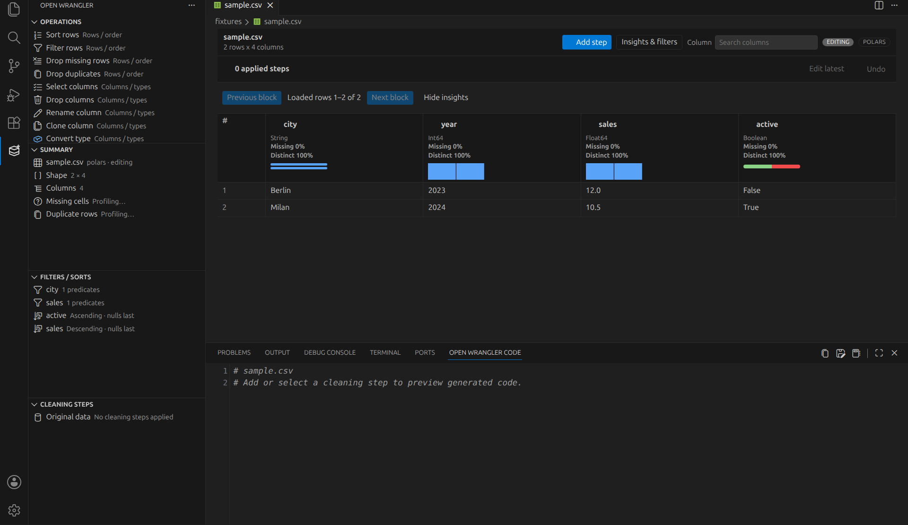
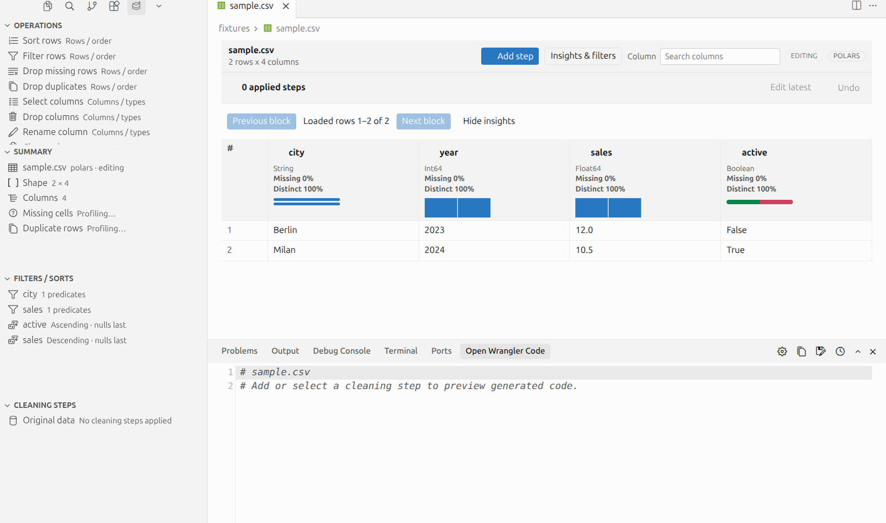

# Open Wrangler

Open Wrangler is an open-source dataframe wrangler for VS Code-compatible editors, including forks such as Cursor. The current preview combines fast Polars, DuckDB, and Pandas viewing foundations with non-destructive cleaning, draft diffs, history, deterministic by-example synthesis, engine-native code, explicit exports, and notebook code insertion.

Open Wrangler is an independent, clean-room project explicitly inspired by Microsoft Data Wrangler for VS Code and deliberately targets parity with its documented viewing and cleaning workflows. It does not copy Microsoft code or assets. Data Wrangler is closed source, which makes it difficult to contribute features upstream, adapt it for VS Code forks such as Cursor, or add backend-native capabilities such as first-class Polars support. Open Wrangler exists to make that workflow open, hackable, portable across VS Code-compatible editors, and engine-friendly from the start.

The extension package identity is `Matt17BR.openwrangler`. Commands, settings, editor views, notebook output, runtime modules, and release artifacts all use the Open Wrangler name and `openWrangler.*` namespace.

## Screenshots

The workbench screenshots come from the real packaged VSIX installed into isolated VS Code and Cursor profiles; only the native test-host title strip is omitted. The focused UI screenshots are generated from the same production webview/notebook bundles using `npm run capture:screenshots`; the capture loads `fixtures/sample.csv` through Polars and executes `fixtures/example.ipynb` with `nbclient`.






## Features

- Native Polars, DuckDB, and Pandas runtime backends for files; live notebook sessions remain Pandas/Polars and run in the active Jupyter kernel.
- Direct launch for CSV, TSV, Parquet, JSONL, XLSX, and XLS files from the Explorer, editor-tab menu, editor-title icon, or Command Palette.
- Typed rendering and profiling for nullable values, large integers, decimals, time zones, nested Polars lists/structs, binary, categorical, duration, NaN, and infinity values.
- Two-axis virtualized dataframe grid with resizable sticky columns, stable row/column IDs, keyboard navigation, column search, progressive Quick Insights, and source/backend-scoped restoration of widths, selection, filters, sorts, and visible position. Horizontal virtualization is end to end: the webview requests only aligned visible-column blocks, Pandas selects them positionally, lazy Polars projects before collection, and DuckDB issues an explicit terminal projection.
- Exact first-grid metadata with deferred per-column profiling, bounded two-dimensional block caching, foreground paging that stays responsive during insights work, source-version detection, and transactional runtime replay after a crash. Initial, draft, history, and ordinary pages all use the same identity-addressed column window instead of serializing a hidden full-width dataframe.
- Dataset summary panel with shape, row/column counts, missing-value breakdowns, and duplicate-row counts.
- Multi-column sorting plus basic and advanced AND/OR viewing filters that remain separate from future cleaning steps.
- Activity Bar views for Operations, Summary, Filters/Sorts, and Cleaning Steps, plus a bottom-panel Code Preview surface.
- Bundled, bundle-relative VS Code Codicons render consistently in VS Code, Cursor, and isolated browser acceptance instead of depending on an editor or system font fallback.
- A searchable 27-operation catalog with native Polars, DuckDB, and Pandas execution for row, column, text, categorical, numeric, datetime, grouping, by-example, and custom-code transforms.
- All 26 cleaning operations that address input columns use stable `{id, name}` identities instead of displayed-name fallbacks, including group keys/aggregation inputs and every by-example source or saved-program leaf. By-example examples are ordered scalar arrays aligned with the selected source order; synthesis is bounded to 8 KiB per string, 64 KiB total UTF-8 text, and 64 warning entries. Pandas executes bound paths positionally—including grouping, in-place changes, and categorical encoding—so equal or non-string labels are not silently conflated; Polars and DuckDB receive verified native names only after binding. Viewing filters/sorts remain separate non-destructive state, and copying them into a cleaning step fails clearly if a displayed name is ambiguous. Edited output identities replay deterministically through later steps and undo. Private row IDs stay unreachable under case changes and Pandas MultiIndex labels, generated outputs are collision-checked, DuckDB rejects case-only ambiguity, and every transformation must retain one visible column. Complete exact-artifact installed-editor acceptance remains a 1.0 gate.
- Validated engine-native edge semantics for per-column null sorting, missing/duplicate modes, Unicode casing and whitespace stripping, empty-pattern replacement, finite numeric scaling, nullable groups, and collision-safe categorical output. Integer group sums and by-example arithmetic widen past 64 bits, remain exact and order-independent through a shared 38-digit envelope—including UInt128/UHUGEINT cancellation—and fail clearly beyond it instead of wrapping. Polars performs bounded native limb aggregation, while Pandas preserves exact NumPy/Python integers, decimal-sum precision and scale, wide keys, extrema, and nanosecond temporal cells; decimal mean/median results use one nullable-float contract. Missing string/datetime/group results stay typed null rather than becoming Pandas NaN. One-hot encoding accepts numeric, boolean, date, and text inputs; excludes blank, null, and NaN values consistently; and publishes generated columns in one deterministic order across engines.
- Draft-first editing with typed data diffs, explicit apply/discard, latest-step editing, undo replay, and editable CodeMirror Python preview. Add and edit commands are unavailable while a draft exists; invoking Add Cleaning Step without a preselected operation opens the searchable catalog.
- Keyboard cleaning workflow: `Ctrl/Cmd+Enter` applies a draft, `Escape` discards it, `Ctrl/Cmd+Shift+E` edits the latest step, and `Ctrl/Cmd+Alt+Z` undoes it.
- Deterministic by-example synthesis for slicing, splitting, concatenation/literals, regex extraction/replacement, casing, datetime formatting, and arithmetic, with explicit ambiguity warnings.
- By-example numeric examples reject integer JSON tokens outside JavaScript's exact safe range before parsing can round them. Use smaller examples to infer the same transform; the retained program still runs against exact engine-native integers throughout the supported 38-digit arithmetic envelope.
- Clipboard and Python-script code export plus atomic cleaned-data export to CSV or Parquet. Data export uses the committed plan, excludes view-only filters, and never overwrites the source.
- Jupyter variable viewer integration for Pandas and Polars dataframe names, with the full window reading from the live kernel.
- MIME v2 notebook snapshots and permission-aware automatic Pandas/Polars formatters.
- Notebook-origin sessions can insert the edited generated cleaning function back into the exact originating notebook.

## Example Usage

### Open a file

1. Install the extension in Cursor or VS Code.
2. Open a `.csv`, `.tsv`, `.parquet`, `.jsonl`, `.xlsx`, or `.xls` file, then use the **Open in Open Wrangler** editor-title icon; alternatively, right-click its editor tab or Explorer item.
3. Choose **Open in Open Wrangler** when using a context menu.
4. Use the column headers or **Insights & filters** drawer to search values, compose predicates, and sort. The Activity Bar mirrors active-session state.
5. Choose **Add step**, run **Open Wrangler: Add Cleaning Step** without arguments from the Command Palette to open the unselected catalog, or choose a preselected operation in the Activity Bar. Configure it, inspect the draft grid/diff/code, then explicitly apply or discard it before starting another operation. Use `Ctrl/Cmd+Enter` to apply, `Escape` to discard, `Ctrl/Cmd+Shift+E` to edit the latest step, or `Ctrl/Cmd+Alt+Z` to undo. The plan, optional draft, viewing query, column widths/selection, and visible position are restored for the same source and backend in the workspace.
6. Run **Open Wrangler: Copy Generated Code**, **Export Python Script**, or **Export Cleaned Data**. Apply or discard any active draft first; exports always use committed steps.

CSV/TSV commands prompt for delimiter, encoding, quote character, and header behavior; Excel commands prompt for a sheet. Custom-editor opens use deterministic defaults. File types, start modes, insights, filters, widths, row block size, and column block size are configurable under `openWrangler.*` settings.

Cursor 3.11 hides third-party editor-title actions by default, so Open Wrangler declaratively pins its canonical file action there without writing to the user's settings. To hide that icon intentionally, set `cursor.general.pinnedTitleActions` to a list that omits `openWrangler.openFile`; Cursor's normal **Configure Icon Visibility** toggle does not override its pinned-action list in that version.

File-backed sessions use `auto` by default. Candidate order is Polars, then DuckDB, then Pandas; unavailable or format-incompatible candidates are skipped. The `utf8-lossy` import option is a replacement-decoding policy rather than a Python codec name, so automatic selection routes directly to Pandas and reads invalid UTF-8 bytes as `�`. Set `openWrangler.defaultBackend` to `polars`, `duckdb`, or `pandas` to pin one engine.

### Open a notebook variable

Run a cell that leaves a Pandas or Polars dataframe available in the active Jupyter kernel. Jupyter can surface **Open in Open Wrangler** for supported variables via the variable viewer integration, or you can use **Open Wrangler: Open Notebook Variable** and enter the dataframe variable name:

```python
import polars as pl

df = pl.read_csv("sales.csv")
```

Open Wrangler detects Polars and Pandas dataframe variables and opens them with the matching backend. For notebook variables, paging, filtering, sorting, and Quick Insights execute against the live kernel variable rather than a static snapshot.

### Render an inline notebook preview

```python
import polars as pl
from openwrangler_runtime.notebook import show

df = pl.read_csv("sales.csv")
show(df, label="sales")
```

This emits `application/vnd.openwrangler.viewer.v2+json`, which the bundled notebook renderer displays as a compact, typed grid preview. Pass `variable_name="df"` when the **Open in Open Wrangler** button should reconnect the snapshot to a live kernel variable; otherwise it opens the immutable saved snapshot.

## Polars Support

Polars dataframes stay Polars in the runtime. The Polars backend uses native operations for:

- lazy file scans with `polars.scan_csv`, `scan_parquet`, and `scan_ndjson`; Excel uses `read_excel`
- paging with `slice`
- filters with Polars expressions
- sorting with `DataFrame.sort`
- summaries with Polars null counts, distinct counts, value counts, and numeric aggregates
- the complete transformation catalog and generated Polars code

The test suite asserts that Polars file sessions do not call `to_pandas()`, including nested Parquet profiling and every transformation family. Polars reads both modern `.xlsx` and legacy BIFF `.xls` workbooks through `fastexcel>=0.9`. Pandas uses `openpyxl>=3.1.5` for `.xlsx` and `xlrd>=2.0.1` for `.xls`; setup diagnostics request only the parser required by the selected backend and format.

## DuckDB Support

DuckDB file sessions remain native lazy `DuckDBPyRelation` plans for CSV, TSV, Parquet, and JSONL. Paging, filters, sorting, profiling, the complete transformation catalog, generated code, and CSV/Parquet exports execute through DuckDB without converting to Pandas, Polars, or Arrow.

The selected Python environment must provide `duckdb>=1.4.5,<1.6`. The editable `python[dev]` install below includes that dependency; the packaged extension probes the selected interpreter and always shows a modal naming the exact packages and interpreter before installing anything. Command arguments cannot bypass that confirmation. DuckDB support is currently file-backed: DuckDB Excel ingestion, browsing tables inside `.duckdb` database files, and DuckDB notebook variables/formatters are explicitly deferred. Excel remains available through Polars or Pandas, and notebook sessions remain Pandas/Polars.

## PySpark Status

PySpark dataframes are not supported yet. Native classic-Spark and Spark Connect support is tracked in the [PySpark engine expansion](https://github.com/Matt17BR/openwrangler/issues/36), scheduled after the Pandas/Polars parity contract is green. That work must preserve distributed execution—no implicit Pandas/Polars conversion or full-frame collection—and define deterministic paging, ordering, counts, cancellation, recovery, code generation, and cluster/session ownership before it is advertised as available.

## Test Locally In Cursor Or Another VS Code-Compatible Editor

```bash
npm install
python3 -m venv .venv
.venv/bin/python -m pip install -e "python[dev]"
npm run build
npm run package
cursor --install-extension openwrangler-0.3.0.vsix --force
```

Reload the editor after installing the VSIX. Then:

- Open `fixtures/sample.csv`, then click the **Open in Open Wrangler** editor-title icon or choose the same action from the editor-tab or Explorer context menu.
- Open `fixtures/example.ipynb`, select the `.venv` Python kernel, and run the notebook cell. The dataframe is a real Polars dataframe.
- From the notebook, use **Open in Open Wrangler** when Jupyter offers it for `df`, or run **Open Wrangler: Open Notebook Variable** and enter `df`. The full Open Wrangler webview should page, filter, sort, and summarize the live kernel dataframe.

## Development

```bash
npm install
python3 -m venv .venv
.venv/bin/python -m pip install -e "python[dev]"
npm run build
npm test
```

Useful checks:

```bash
npm run test:ts
npm run test:python
npm run test:webview-acceptance
npm run benchmark:runtime
npm run reference:check
npm run build
npm run package -- --out openwrangler.vsix
npm run verify:vsix -- openwrangler.vsix
npm run test:packaged-editors -- openwrangler.vsix
```

The generated [interface reference](docs/reference.md) lists every public command, setting, transformation, protocol message, and notebook MIME type. Run `npm run generate:reference` after changing any of those registries; CI rejects stale output.

Run the extension from Cursor or VS Code with `Launch Extension`, or package it with:

```bash
npm run package -- --out openwrangler.vsix
```

## Current Scope

Open Wrangler currently prioritizes the release-grade viewing and editing core:

- grid viewing
- file-backed sessions
- live notebook variable and notebook output entry points
- filters, sorting, schema, summaries, and Quick Insights
- native session-aware VS Code views and an original Activity Bar/gallery identity
- draft-first cleaning operations, data diffs, replayable history, and native code generation

The checked-in Data Wrangler 1.24.2 clean-room behavior matrix is the release gate. Several rows still require packaged import-error and legacy-Excel interaction, Restricted Mode, released-Jupyter and coordinator-owned saved-output sessions, editor first-grid timing, or cross-platform acceptance named there, so this build remains an explicitly incomplete preview. Intentionally deferred scope is listed separately in `docs/feature-parity.md`.
