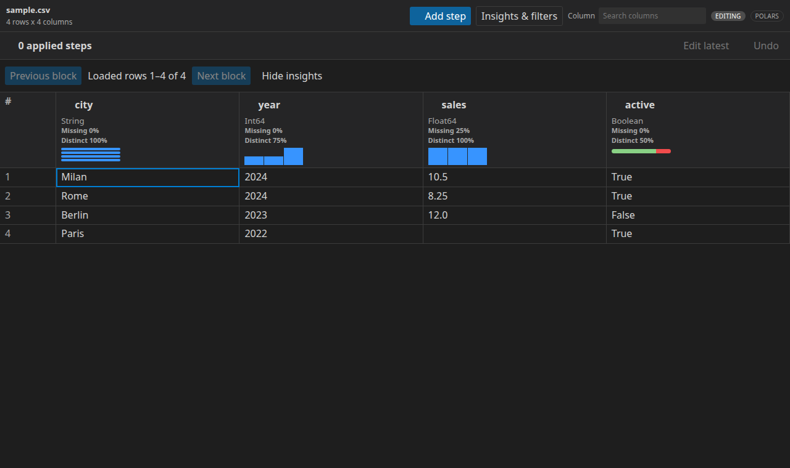
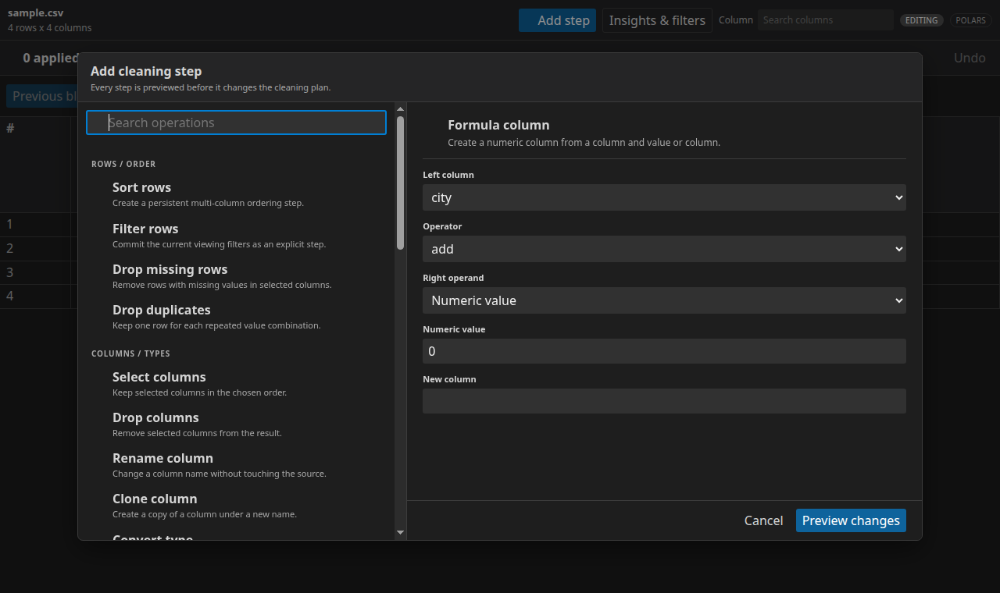
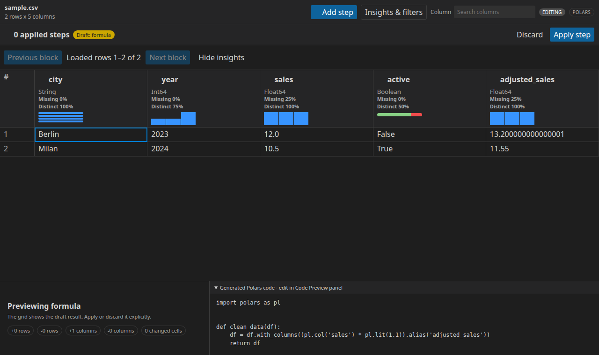
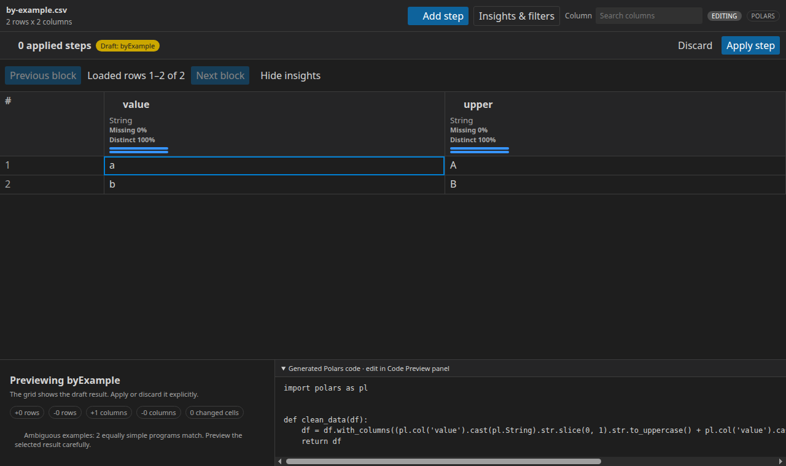
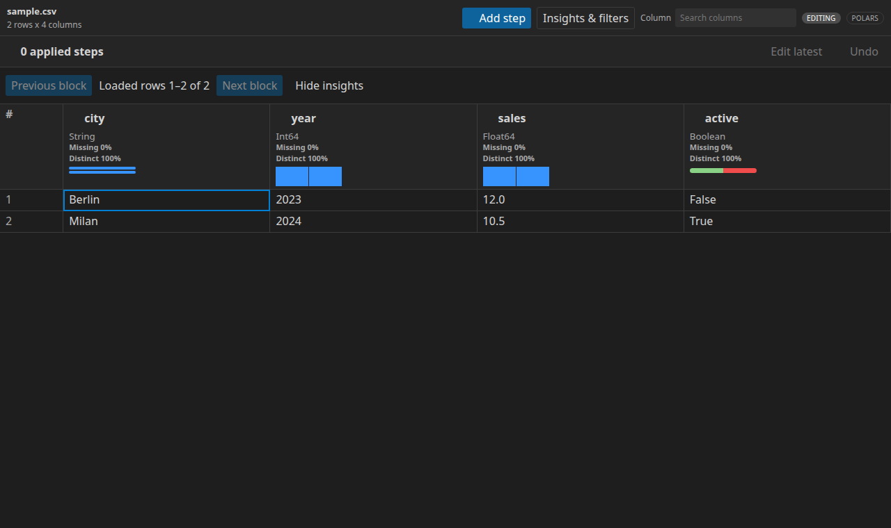
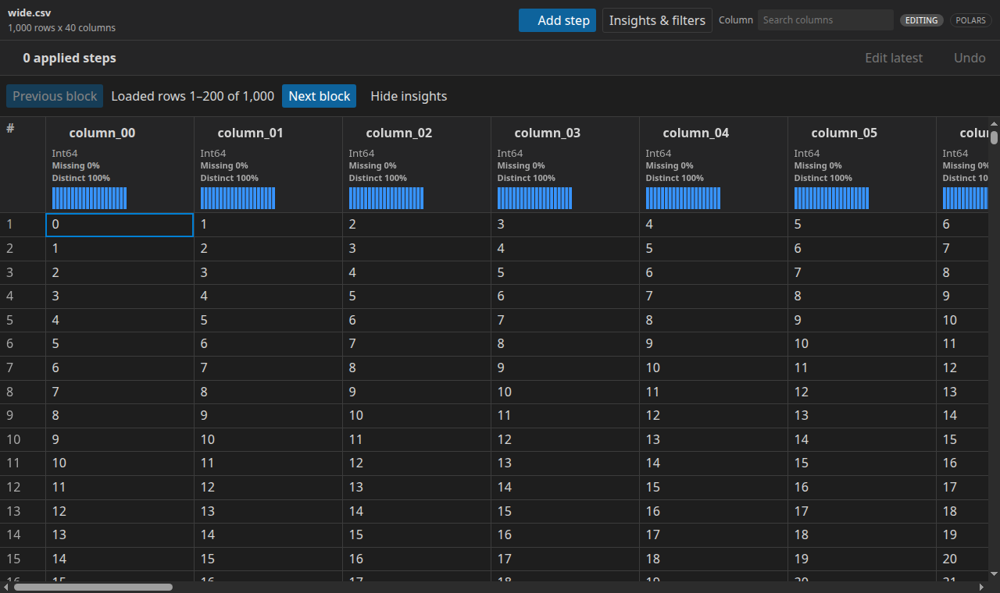
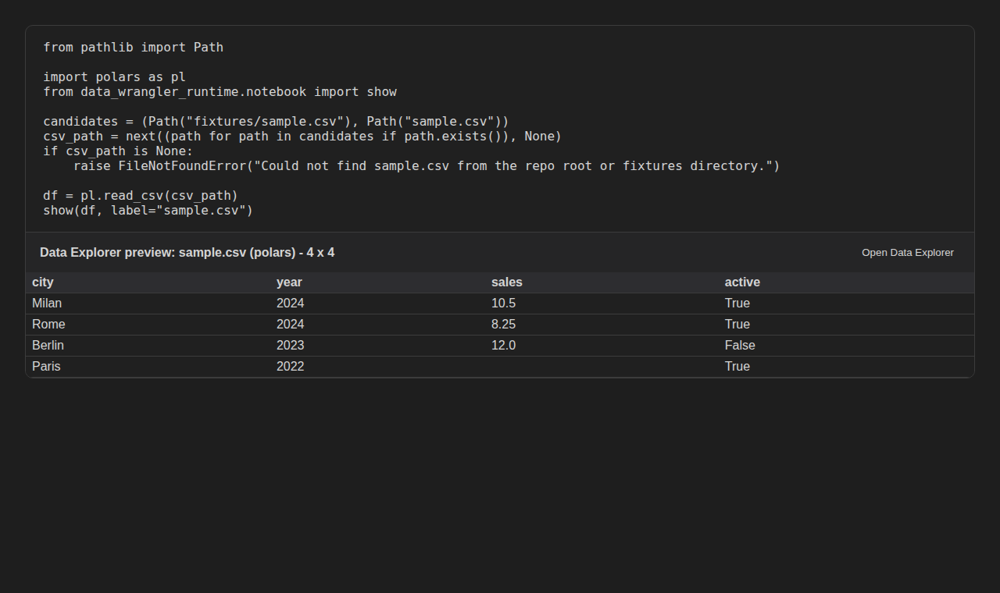

# Data Explorer

Data Explorer is an open-source dataframe wrangler for VS Code-compatible editors, including forks such as Cursor. The current prerelease combines a fast Polars/Pandas viewing foundation with non-destructive cleaning, draft diffs, history, deterministic by-example synthesis, engine-native code, explicit exports, and notebook code insertion.

It is loosely inspired by Microsoft's VS Code Data Wrangler experience, but it is an independent implementation. Data Wrangler is closed source, which makes it difficult to contribute features upstream, adapt it for VS Code forks such as Cursor, or implement backend-native features like first-class Polars support. Data Explorer exists to make that exploration layer open, hackable, and Polars-friendly from the start.

## Screenshots

These screenshots are generated from the real built webview/notebook renderer using `npm run capture:screenshots`. The capture script loads `fixtures/sample.csv` through the Polars runtime and executes `fixtures/example.ipynb` with `nbclient` to capture the current notebook MIME renderer output.















## Features

- Native Polars and Pandas runtime backends, including live notebook sessions backed by the active Jupyter kernel.
- Direct launch for CSV, TSV, Parquet, JSONL, XLSX, and XLS files.
- Two-axis virtualized dataframe grid with resizable sticky columns, stable row/column IDs, keyboard navigation, column search, and progressive Quick Insights.
- Dataset summary panel with shape, row/column counts, missing-value breakdowns, and duplicate-row counts.
- Multi-column sorting plus basic and advanced AND/OR viewing filters that remain separate from future cleaning steps.
- Activity Bar views for Operations, Summary, Filters/Sorts, and Cleaning Steps, plus a bottom-panel Code Preview surface.
- A searchable 27-operation catalog with native Pandas/Polars execution for row, column, text, categorical, numeric, datetime, grouping, by-example, and custom-code transforms.
- Draft-first editing with typed data diffs, explicit apply/discard, latest-step editing, undo replay, and editable CodeMirror Python preview.
- Deterministic by-example synthesis for slicing, splitting, concatenation/literals, regex extraction/replacement, casing, datetime formatting, and arithmetic, with explicit ambiguity warnings.
- Clipboard and Python-script code export plus atomic cleaned-data export to CSV or Parquet. Data export uses the committed plan, excludes view-only filters, and never overwrites the source.
- Jupyter variable viewer integration for Pandas and Polars dataframe names, with the full window reading from the live kernel.
- MIME v2 notebook snapshots and permission-aware automatic Pandas/Polars formatters, while saved MIME v1 outputs remain renderable.
- Notebook-origin sessions can insert the edited generated cleaning function back into the exact originating notebook.

## Example Usage

### Open a file

1. Install the extension in Cursor or VS Code.
2. Right-click a `.csv`, `.tsv`, `.parquet`, `.jsonl`, `.xlsx`, or `.xls` file.
3. Choose **Data Explorer: Open Current File**.
4. Use the column headers or **Insights & filters** drawer to search values, compose predicates, and sort. The Activity Bar mirrors active-session state.
5. Choose **Add step** or an operation in the Activity Bar, configure it, inspect the draft grid/diff/code, then explicitly apply or discard it. Applied steps can be edited from the latest step or undone. The plan, an optional draft, and viewing query are restored when the same source is reopened in the workspace.
6. Run **Data Explorer: Copy Generated Code**, **Export Python Script**, or **Export Cleaned Data**. Apply or discard any active draft first; exports always use committed steps.

CSV/TSV commands prompt for delimiter, encoding, quote character, and header behavior; Excel commands prompt for a sheet. Custom-editor opens use deterministic defaults. File types, start modes, insights, filters, widths, and block sizes are configurable under `dataExplorer.*` settings.

File-backed sessions use `auto` by default: Data Explorer prefers Polars and falls back to Pandas when the selected environment or format requires it. You can pin either engine with `dataExplorer.defaultBackend`.

### Open a notebook variable

Run a cell that leaves a Pandas or Polars dataframe available in the active Jupyter kernel. Jupyter can surface **Open in Data Explorer** for supported variables via the variable viewer integration, or you can use **Data Explorer: Open Notebook Variable** and enter the dataframe variable name:

```python
import polars as pl

df = pl.read_csv("sales.csv")
```

Data Explorer detects Polars and Pandas dataframe variables and opens them with the matching backend. For notebook variables, paging, filtering, sorting, and Quick Insights execute against the live kernel variable rather than a static snapshot.

### Render an inline notebook preview

```python
import polars as pl
from data_wrangler_runtime.notebook import show

df = pl.read_csv("sales.csv")
show(df, label="sales")
```

This emits `application/vnd.data-explorer.viewer.v2+json`, which the bundled notebook renderer displays as a compact, typed grid preview. Saved `application/vnd.data-explorer.viewer.v1+json` output remains supported. Pass `variable_name="df"` when the **Open Data Explorer** button should reconnect the snapshot to a live kernel variable; otherwise it opens the immutable saved snapshot.

## Polars Support

Polars dataframes stay Polars in the runtime. The Polars backend uses native operations for:

- lazy file scans with `polars.scan_csv`, `scan_parquet`, and `scan_ndjson`; Excel uses `read_excel`
- paging with `slice`
- filters with Polars expressions
- sorting with `DataFrame.sort`
- summaries with Polars null counts, distinct counts, value counts, and numeric aggregates
- the complete transformation catalog and generated Polars code

The test suite asserts that Polars file sessions do not call `to_pandas()`.

## Test Locally In Cursor Or Another VS Code-Compatible Editor

```bash
npm install
python3 -m venv .venv
.venv/bin/python -m pip install -e "python[dev]"
npm run build
npm run package
cursor --install-extension data-explorer-0.2.0-alpha.1.vsix --force
```

Reload the editor after installing the VSIX. Then:

- Open `fixtures/sample.csv`, right-click the editor tab or Explorer item, and run **Data Explorer: Open Current File**.
- Open `fixtures/example.ipynb`, select the `.venv` Python kernel, and run the notebook cell. The dataframe is a real Polars dataframe.
- From the notebook, use **Open in Data Explorer** when Jupyter offers it for `df`, or run **Data Explorer: Open Notebook Variable** and enter `df`. The full Data Explorer webview should page, filter, sort, and summarize the live kernel dataframe.

For development, set `dataExplorer.pythonPath` to the workspace `.venv/bin/python` if it is not already the environment selected by the Python extension. In normal use the setting is empty: Data Explorer resolves the selected Python extension environment first and then a system Python. It validates Python 3.10-3.14 and asks before installing any missing engine or format dependency.

## Development

```bash
npm install
python3 -m venv .venv
.venv/bin/python -m pip install -e "python[dev]"
npm run build
npm test
```

Useful checks:

```bash
npm run test:ts
npm run test:python
npm run test:webview-acceptance
npm run reference:check
npm run build
npm run package
npm run test:packaged-editors -- data-explorer.vsix
```

The generated [interface reference](docs/reference.md) lists every public command, setting, transformation, protocol message, and notebook MIME type. Run `npm run generate:reference` after changing any of those registries; CI rejects stale output.

Run the extension from Cursor or VS Code with `Launch Extension`, or package it with:

```bash
npm run package
```

## Current Scope

Data Explorer currently prioritizes the release-grade viewing and editing core:

- grid viewing
- file-backed sessions
- live notebook variable and notebook output entry points
- filters, sorting, schema, summaries, and Quick Insights
- native session-aware VS Code views and an original Activity Bar/gallery identity
- draft-first cleaning operations, data diffs, replayable history, and native code generation

It does not yet claim Data Wrangler parity. Real-kernel restart/permission matrices, exhaustive edge fixtures, broader by-example inference, packaged reload testing, and final VS Code/Cursor release acceptance are still tracked in `docs/feature-parity.md`.
