# Product gallery

These scenes use realistic, license-clean fixtures and the packaged extension. Fixture dimensions show the
captured scenario, not product row or column limits.

[Explore](#explore-in-vs-code) · [Profiles and sorts](#inspect-profiles-and-control-sort-priority) ·
[Transform](#review-a-cleaning-workflow) · [Open files](#open-files-where-you-already-work) · [Export](#export-code-and-clean-data) ·
[Notebooks](#notebook-workflows) · [Editors](#vscode-and-cursor)

## Explore in VS Code

The native sidebar keeps the operation catalog, active dataframe summary, viewing state, and cleaning history
visible beside the grid. Header summaries and the **Column profiles** drawer show exact statistics and a complete
distribution for the selected numeric column.

## Native Activity Bar views

<table>
  <tr>
    <td width="50%"><a href="images/readme/v1.2/gallery/sidebar-explore.png">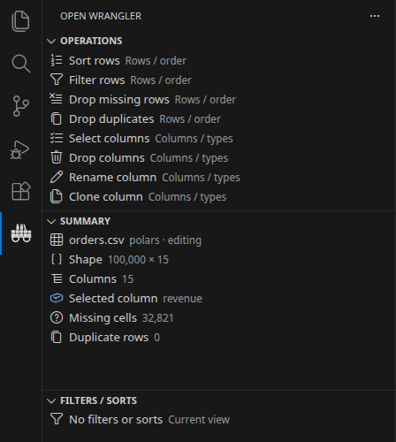</a></td>
    <td width="50%"><a href="images/readme/v1.2/gallery/sidebar-workflow.png">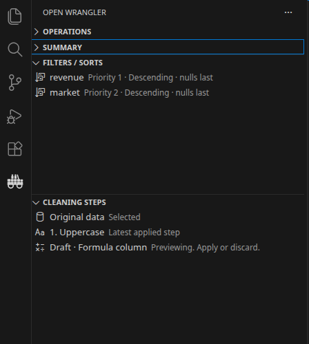</a></td>
  </tr>
  <tr>
    <td><strong>Operations and Summary remain useful without opening another editor tab.</strong> The catalog is grouped by task, while source, engine, mode, shape, selection, missing cells, and duplicate rows stay visible beside the dataframe.</td>
    <td><strong>Viewing state and cleaning history remain independent.</strong> Two sorts retain ordered priorities and never masquerade as cleaning steps; Original data, applied history, and the current draft stay separately inspectable.</td>
  </tr>
</table>

## Inspect profiles and control sort priority

<table>
  <tr>
    <td width="50%"></td>
    <td width="50%"></td>
  </tr>
  <tr>
    <td><strong>Sparse bins remain easy to inspect.</strong> Keyboard focus and pointer hover use the full bin height, then expose the exact interval and row count.</td>
    <td><strong>Compound sort order stays explicit.</strong> The latest key becomes priority 1; inline actions reorder or remove keys, while opening one edits direction and null placement.</td>
  </tr>
</table>

## Review a cleaning workflow

The newest viewing sort is priority 1, priorities remain reorderable, and neither sort becomes a cleaning step.
The cleaning plan first normalizes market labels, then previews a separate projected-revenue formula. The draft
highlights its added values, exposes Apply and Discard, and generates both executable Polars steps in the native
bottom panel.

## Open files where you already work

### Editor title action

Open a supported file without leaving its current editor.

### Tab context menu

The same command is available from the open editor tab.

CSV and TSV inputs infer delimiter, encoding, quote style, and header automatically. **Import options** remains
available for explicit overrides.

The ordinary open path needs no questions. When a source is unusual, **Import options** starts from the detected
configuration instead of asking the user to reconstruct it from memory.

## Navigate wide schemas

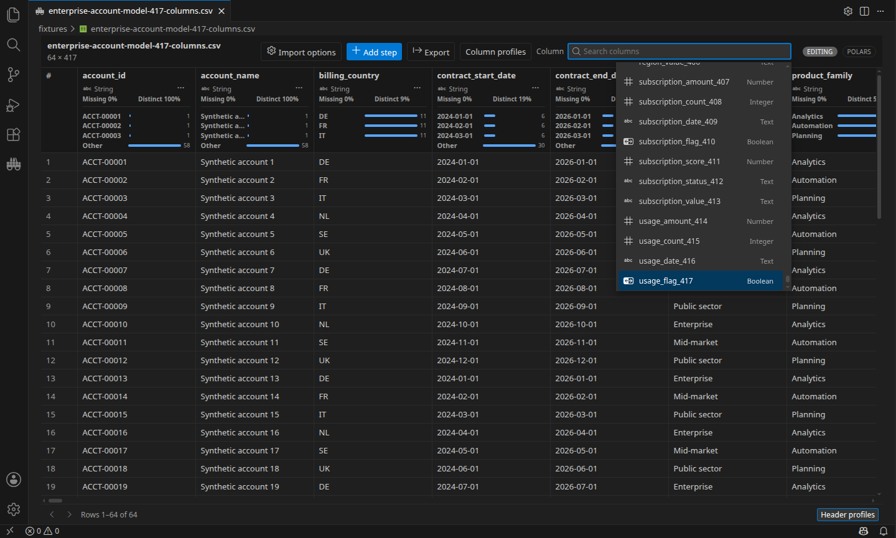

Column search virtualizes the complete schema and keeps type icons, full names, and keyboard position available.
This scene intentionally navigates to item 417 of 417 to prove the list is not capped at the first 100 columns;
417 is a deterministic fixture size, not a product limit.

## Export code and clean data

<table>
  <tr>
    <td width="50%"><a href="images/readme/v1.2/gallery/export-script.png">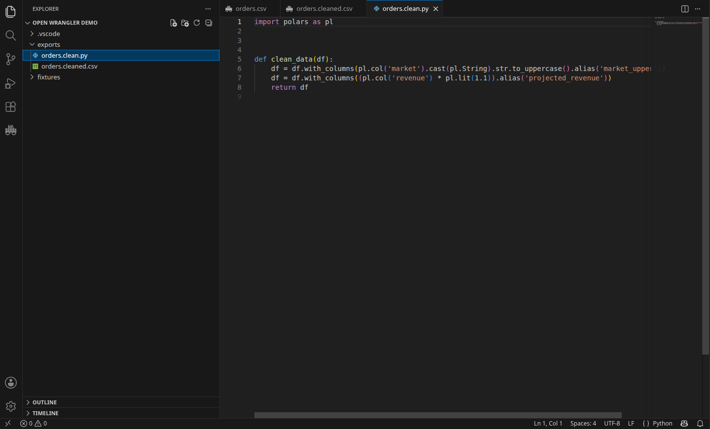</a></td>
    <td width="50%"><a href="images/readme/v1.2/gallery/export-data.png">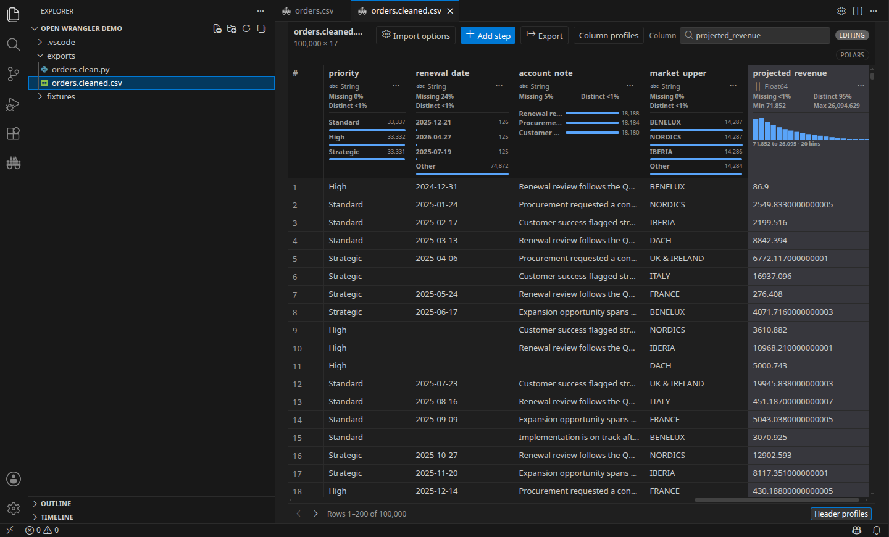</a></td>
  </tr>
  <tr>
    <td><strong>Reusable code.</strong> The saved script contains the applied engine-native cleaning plan rather than a screenshot-only approximation.</td>
    <td><strong>Separate output.</strong> The cleaned file opens normally while the source bytes remain unchanged.</td>
  </tr>
</table>

## Notebook workflows

### Choose a live variable by engine

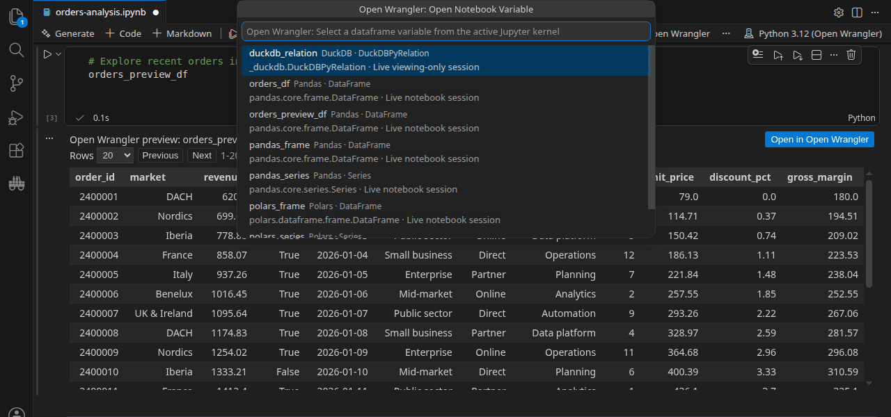

The notebook toolbar discovers supported variables from the active kernel and labels each candidate with its
actual engine and dataframe type before launch. DataFrames and Series remain distinct, and DuckDB relations do
not masquerade as Pandas objects.

### Pandas inline preview

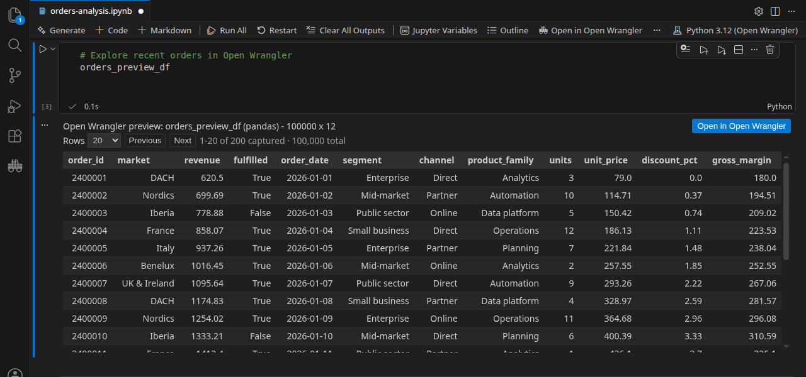

The portable inline table is stored with the notebook. **Open in Open Wrangler** reconnects to the complete,
current live variable and pages it in the workbench.

### Polars live editing

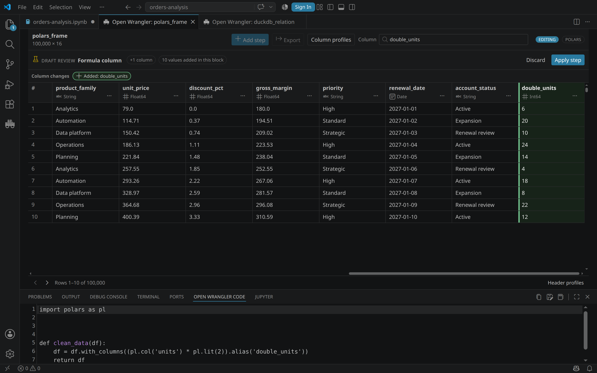

The dataframe remains in Polars while Open Wrangler pages, profiles, previews the draft, computes the diff, and
generates native code. The added values, engine badge, and executable code stay visible together so the draft can
be reviewed as one workflow rather than across disconnected panels.

### DuckDB live relation

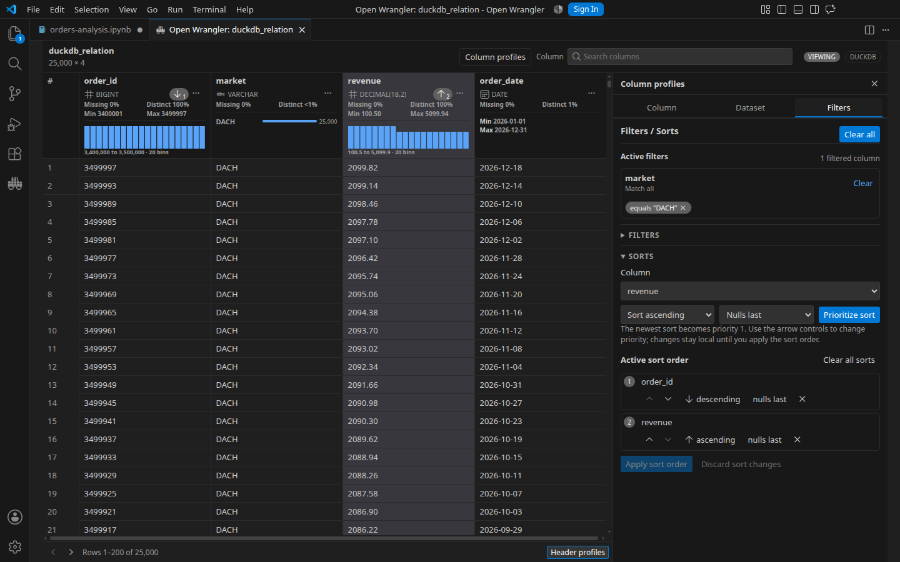

The viewing-only session queries the exact originating `DuckDBPyRelation`; it does not convert through Pandas,
Polars, or Arrow. The image shows a real filter, two reorderable sort priorities, requested profiles, and bounded
paging against the live relation.

### PySpark Classic live notebook

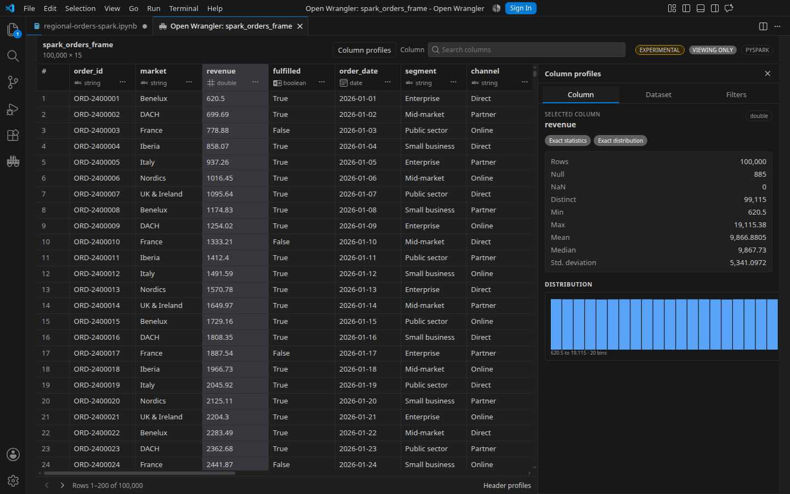

PySpark 4.2 support is experimental and viewing-only. Filtering, sorting, paging, and requested profiling run in
Spark; only bounded results return to the notebook runtime. File opening, cleaning, export, code insertion, and
saved inline previews are not supported.

## Rich DuckDB file types

This focused production-webview scene uses a native DuckDB session over a deterministic 100,000-row Parquet
fixture. Decimal, time-zone-aware timestamp, list, and struct values remain typed through the grid and summaries.

## Transform by example

<a href="images/readme/v1.2/gallery/by-example-setup.png">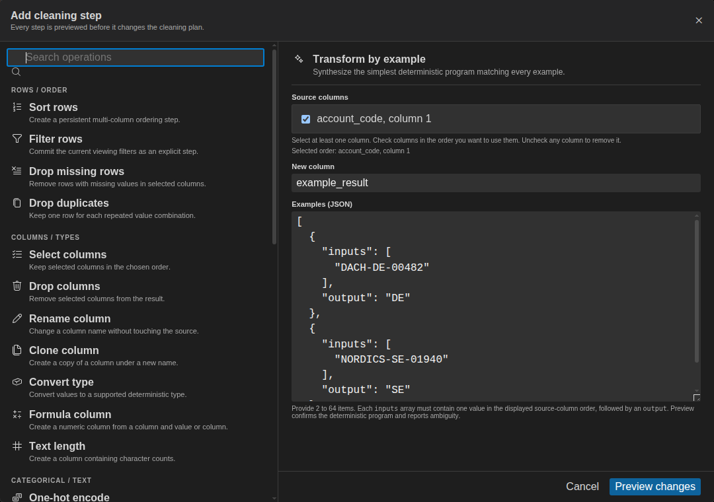</a>

**Teach it.** Give exact source/output examples: `DACH-DE-00482 → DE` and `NORDICS-SE-01940 → SE`. The
operation dialog keeps both mappings' values and outputs visible before synthesis begins.

<a href="images/readme/v1.2/gallery/by-example-preview.png">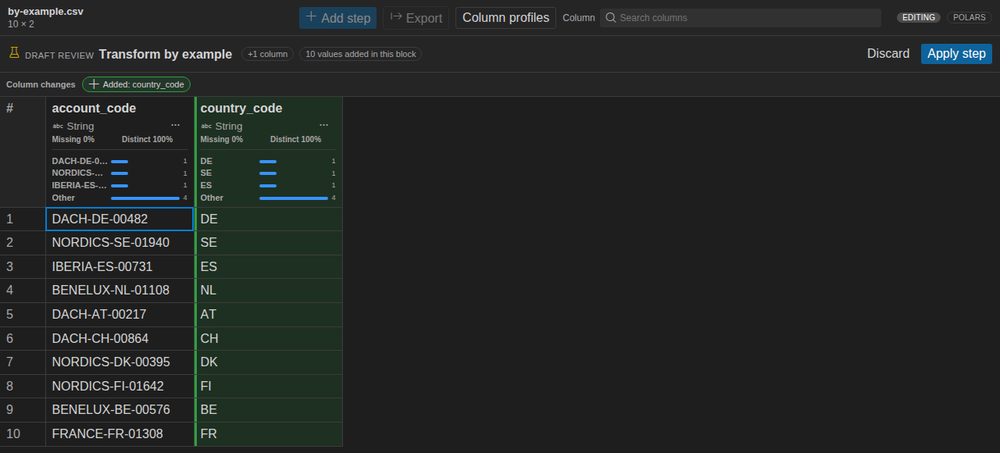</a>

**Review it.** Confirm the synthesized split across all ten unseen account IDs, the complete draft status, and the
Apply / Discard controls before applying the new column.

## VS Code and Cursor

VS Code and Cursor are release-tested from the same VSIX. Other desktop VS Code forks are expected to share the
core extension surface but remain experimental until their marketplace, menus, notebook APIs, and packaged install
path are validated.

The automated visual and accessibility suite also covers light, dark, and high-contrast themes, 80% to 200% zoom,
keyboard-only operation, loading and error states, empty frames, long Unicode content, and narrow and wide
layouts. Those regression images stay in the testing record rather than presenting toy fixtures as product media.
