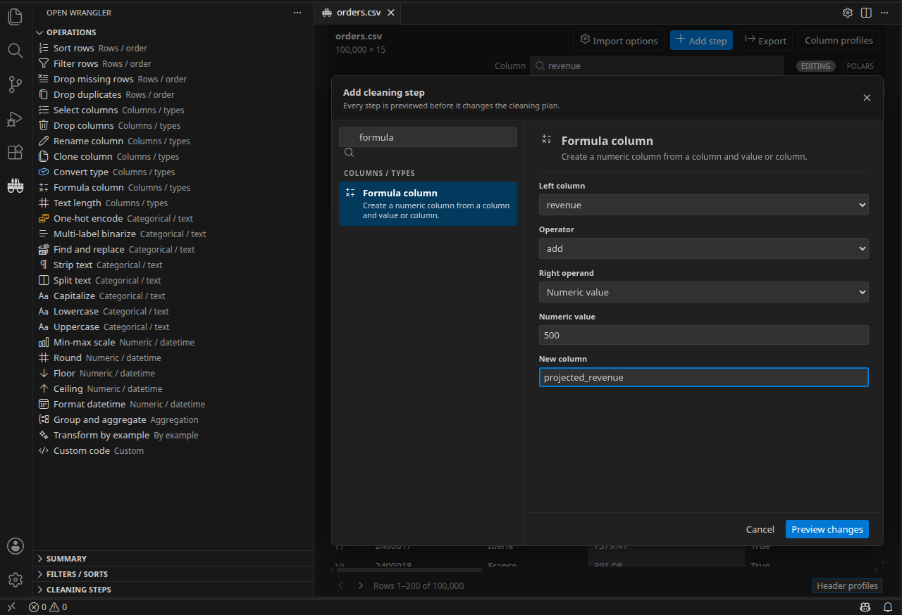
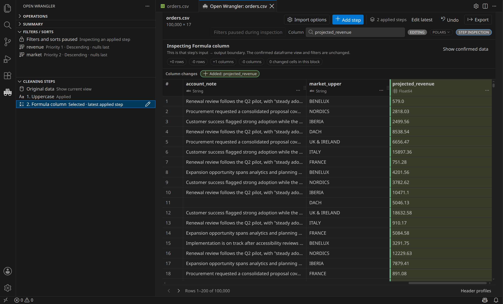

# Product gallery

The full editor scenes below come from the packaged extension running against realistic, license-clean fixtures.
Focused interaction scenes use the same production webview bundle and deterministic fixtures. Visible dimensions
describe the captured scenario, not a product row or column limit.

[Explore](#explore-in-vs-code) · [Open files](#open-files-where-you-already-work) ·
[Profile and navigate](#profile-and-navigate) · [Transform](#build-and-review-a-cleaning-plan) ·
[Export](#export-code-and-clean-data) · [Notebooks](#notebook-workflows) · [Editors](#vscode-and-cursor)

## Explore in VS Code

The workbench keeps the virtualized grid, header summaries, exact profiles, and editor-native controls together.
Only requested row and column blocks cross the runtime boundary.

### Native Activity Bar views

Operations, Summary, Filters / Sorts, and Cleaning Steps stay useful without another editor tab. This scene shows
the native backend and shape, exact dataset counts, an editable two-key sort, one applied step, and a separate
draft at the same time.

## Open files where you already work

### Editor title action

Open a supported file without leaving its current editor.

### Tab context menu

The same command is available from the open editor tab.

CSV and TSV inputs infer delimiter, encoding, quote style, and header automatically. **Import options** remains
available for explicit overrides.

The ordinary open path asks no questions. When a source is unusual, **Import options** starts from the detected
configuration instead of asking the user to reconstruct it from memory.

## Profile and navigate

<table>
  <tr>
    <td width="50%"></td>
    <td width="50%"></td>
  </tr>
  <tr>
    <td><strong>Inspect sparse bins.</strong> Keyboard focus and pointer hover use the full bin height, then expose the exact interval and row count.</td>
    <td><strong>Control compound sorts.</strong> The latest key becomes priority 1; inline actions reorder, edit, or remove keys without changing the source.</td>
  </tr>
</table>

Column search virtualizes the complete schema and keeps type icons, full names, and keyboard position available.
The scene reaches item 417 of 417 to prove the list is not capped at its first page; 417 is a fixture size, not a
product limit.

## Build and review a cleaning plan

### Choose from the complete operation catalog

Search or browse the operation set by task. Opening the catalog does not change the dataframe or cleaning plan.

### Configure before anything changes

The selected source column, operator, value, and output remain visible together. **Preview changes** creates a
draft; it does not commit the step.

### Preview the draft and generated code

Viewing sorts remain separate from the cleaning plan. The draft highlights its added values, exposes Apply and
Discard, and generates executable Polars code in the native bottom panel before the step is committed.

### Inspect applied history

Selecting an applied step opens a bounded, read-only projection while the confirmed dataframe and filters remain
unchanged. **Show confirmed data**, **Edit latest**, and **Undo** are visible here; their executed journeys remain
separate acceptance scenarios.

### Transform by example

**Teach it.** Give exact source/output examples such as `DACH-DE-00482 → DE` and
`NORDICS-SE-01940 → SE`. Both mappings remain visible before deterministic synthesis begins.

**Review it.** Confirm the synthesized split across all ten unseen account IDs and use Apply or Discard only after
the candidate program has been previewed.

## Export code and clean data

<table>
  <tr>
    <td width="50%"></td>
    <td width="50%"></td>
  </tr>
  <tr>
    <td><strong>Reusable code.</strong> The saved script contains the applied engine-native cleaning plan.</td>
    <td><strong>Separate output.</strong> The cleaned file opens normally while the source bytes remain unchanged.</td>
  </tr>
</table>

## Notebook workflows

### Choose a live variable by engine

The notebook toolbar discovers supported variables from the active kernel and labels each candidate with its
actual engine and dataframe type before launch.

### Pandas inline preview

The portable inline table stays with the notebook. When the originating live variable is available, the action
opens the complete current dataframe in the workbench rather than limiting exploration to captured rows.

### Polars live editing

The dataframe remains in Polars while Open Wrangler pages, profiles, previews the draft, computes the current
grid-block diff, and generates native code.

### DuckDB live relation

The viewing-only session queries the exact originating `DuckDBPyRelation`; it does not convert through Pandas,
Polars, or Arrow.

### PySpark Classic live notebook

PySpark 4.2.x support is experimental and viewing-only. The exact selected Python kernel must already contain a
user-managed Classic or Connect session. Opening scans the complete DataFrame, assigns stable row positions, caches
an Open Wrangler-owned indexed child, and computes the exact row total; this can be expensive on large or remote
data. Filtering, sorting, paging, and requested profiling then run in Spark and return only bounded results. The
packaged scene validates local Classic; external or authenticated Connect remains unclaimed. File opening,
cleaning, export, code insertion, and saved inline previews are not supported.

## Rich DuckDB file types

This focused production-webview scene uses a native DuckDB session over a deterministic 100,000-row Parquet
fixture. Decimal, time-zone-aware timestamp, list, and struct values remain typed through the grid and summaries.

## VS Code and Cursor

VS Code and Cursor are release-tested from the same VSIX. Other desktop VS Code forks are experimental until
their marketplace, menus, notebook APIs, and packaged install path are validated.

The automated visual and accessibility suite also covers light, dark, and high-contrast themes, 80% to 200% zoom,
keyboard-only operation, loading and error states, empty frames, long Unicode content, and narrow and wide
layouts. Those regression images remain in the testing record rather than being presented as product media.
