# Product gallery

These scenes use generated business data and show Open Wrangler as users see it in VS Code and Cursor. Dataset
sizes in the images describe the example, not a row or column limit.

[Workbench](#grid-and-sidebar) · [Files](#file-entry-points) ·
[Explore](#filters-profiles-sorts-and-column-search) · [Clean](#cleaning-drafts-and-history) ·
[Export](#export-code-and-cleaned-data) · [Notebooks](#notebook-dataframes) ·
[R preview](#r-notebooks-open-wrangler-2) ·
[Editors](#editor-and-theme-support)

## Grid and sidebar

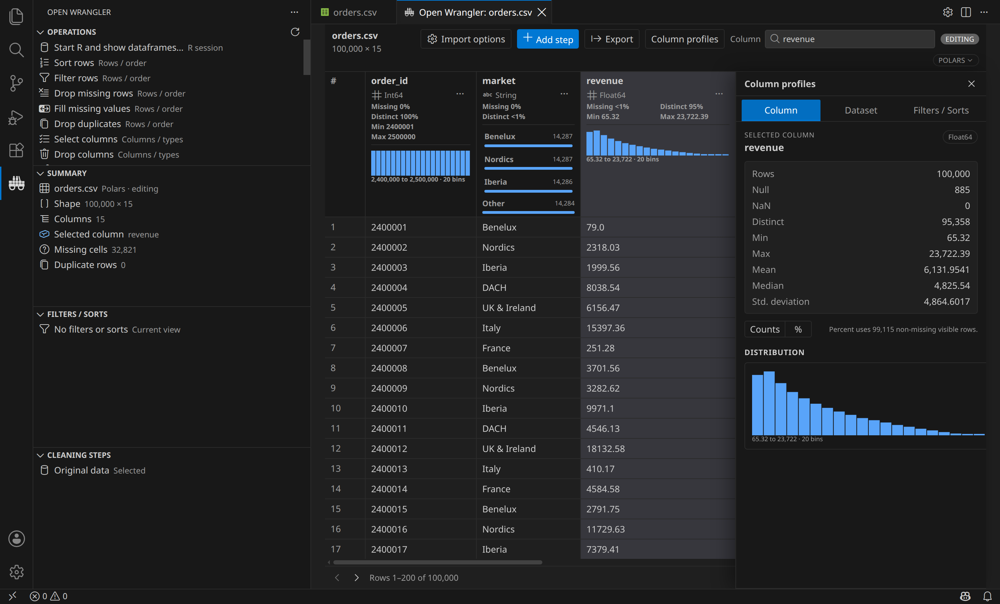

The workbench places the grid, column summaries, detailed profiles, and editor controls together.

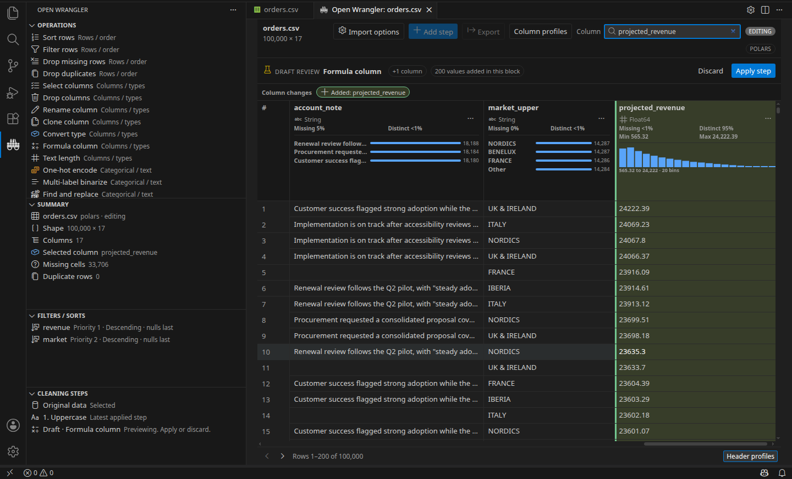

Operations, dataset health, viewing state, and cleaning history appear beside the grid. Filters and sorts remain
separate from applied cleaning steps.

## File entry points

<table>
  <tr>
    <td width="62%"><a href="images/readme/v1.2/gallery/file-explorer-action.png">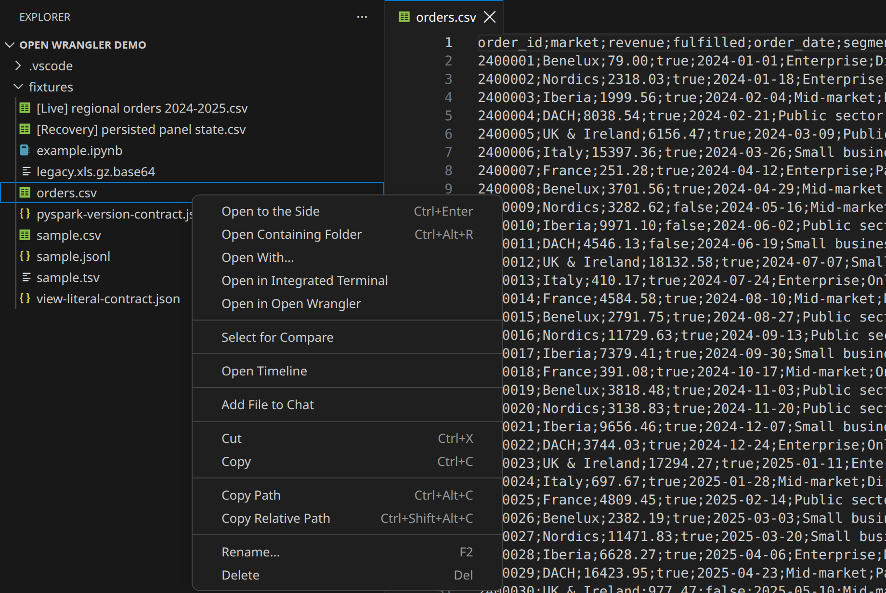</a></td>
    <td width="38%"><a href="images/readme/v1.2/gallery/tab-context-menu.png">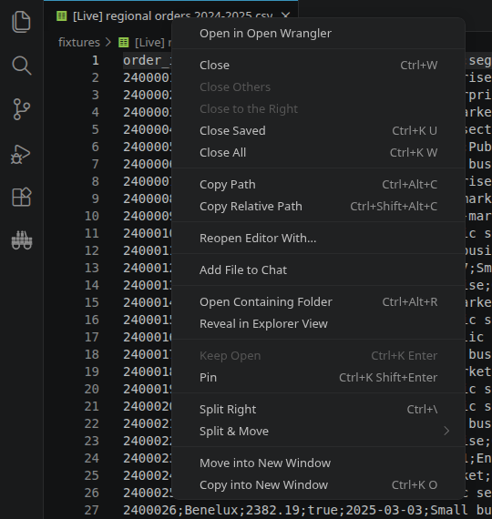</a></td>
  </tr>
  <tr>
    <td>Use the Explorer context menu to open CSV, TSV, Parquet, JSONL, NDJSON, or Excel files.</td>
    <td>Use the editor-tab menu when the file is already open.</td>
  </tr>
</table>

<a href="images/readme/v1.2/gallery/file-title-action.png">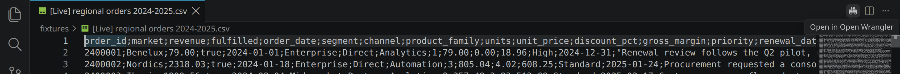</a>

The editor-title action is the shortest route when the source is already open. CSV and TSV inputs infer delimiter,
encoding, quote style, and header automatically. **Import options** is an explicit override for unusual sources.

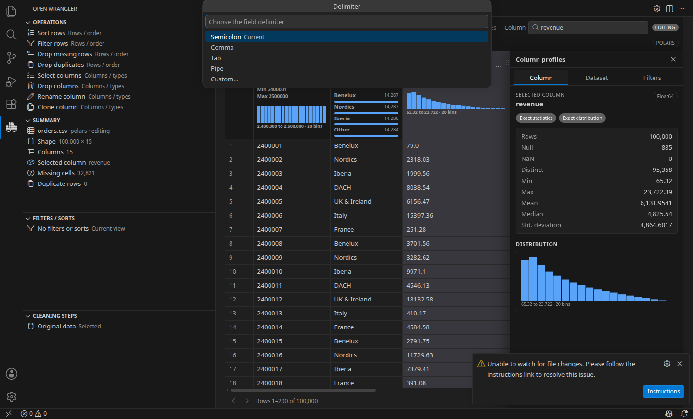

## Filters, profiles, sorts, and column search

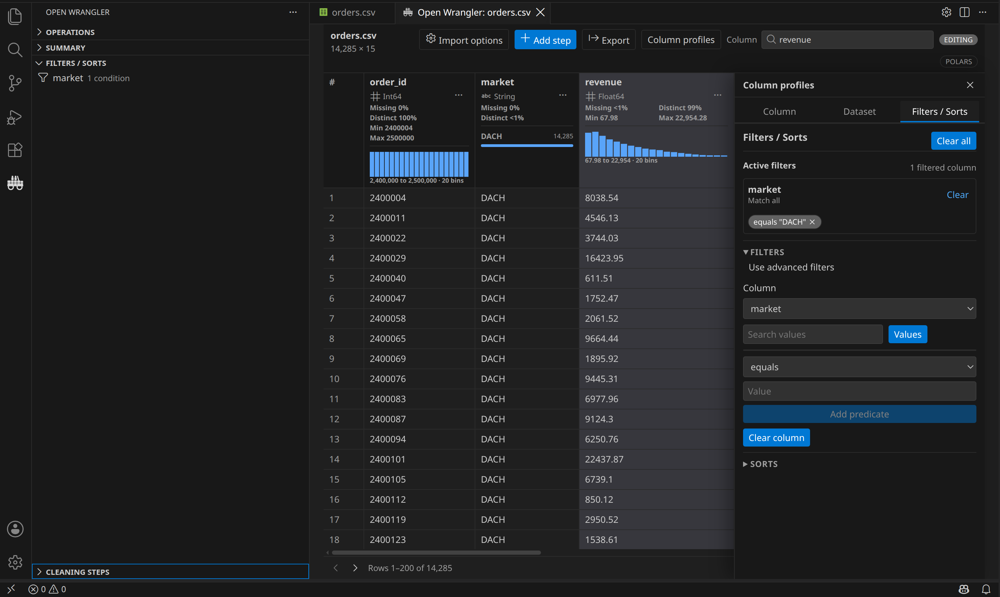

The result count, predicate, clear controls, grid, and native Filters / Sorts view stay synchronized without
changing the source.

<table>
  <tr>
    <td width="50%"><a href="images/readme/v1.2/gallery/histogram-hover.png">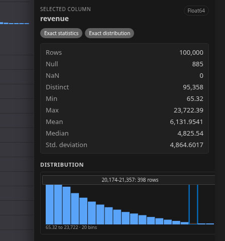</a></td>
    <td width="50%"><a href="images/readme/v1.2/gallery/sort-priority.png">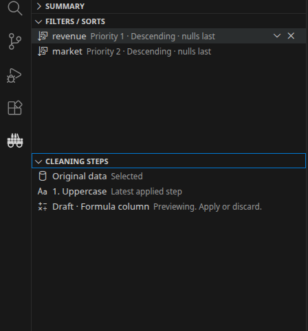</a></td>
  </tr>
  <tr>
    <td>Focus a histogram bin to see its interval and row count.</td>
    <td>Reorder sort keys, change their direction and null placement, or remove them.</td>
  </tr>
</table>

<a href="images/readme/v1.2/gallery/column-search-wide.png">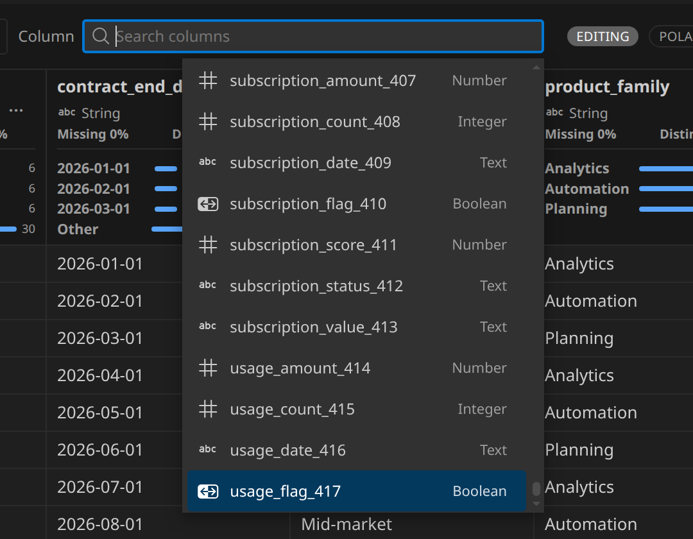</a>

Column search reaches the complete schema and keeps type icons, full names, and keyboard navigation available even
for very wide dataframes.

## Cleaning drafts and history

<table>
  <tr>
    <td width="50%"><a href="images/readme/v1.2/gallery/operation-catalog.png">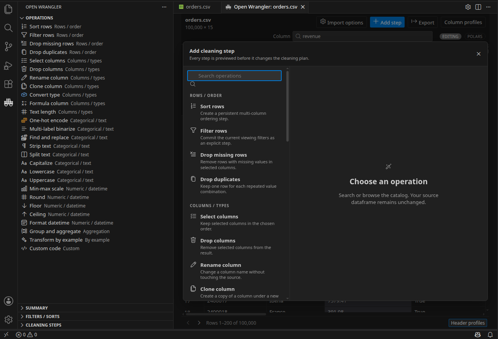</a></td>
    <td width="50%"><a href="images/readme/v1.2/gallery/operation-configuration.png">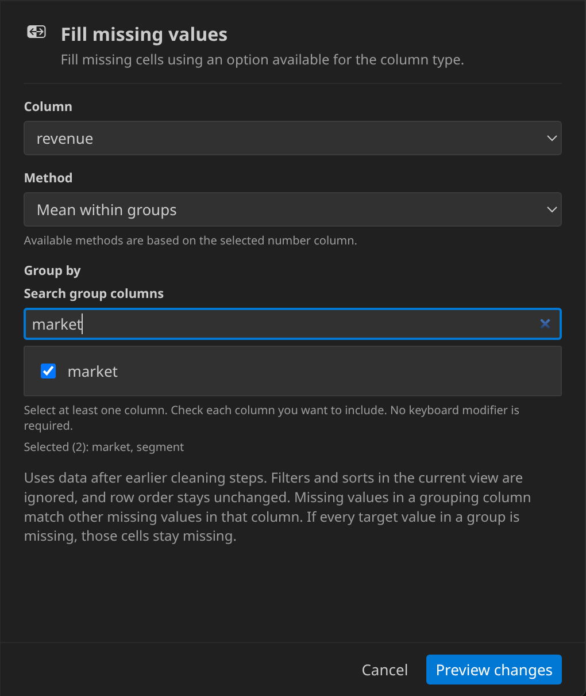</a></td>
  </tr>
  <tr>
    <td>Search or browse 28 operations, including custom code and transformations inferred from examples.</td>
    <td>Edit the operation parameters, then choose <strong>Preview changes</strong> to create a draft.</td>
  </tr>
</table>

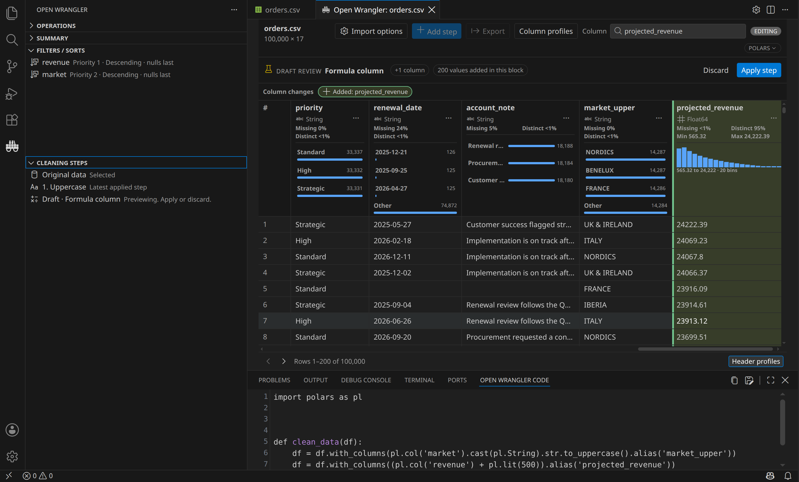

Every operation follows draft → preview → apply or discard. The visible result and executable engine-native code
are available before a step joins the plan.

<table>
  <tr>
    <td width="50%"><a href="images/readme/v1.2/gallery/latest-step-edited.png">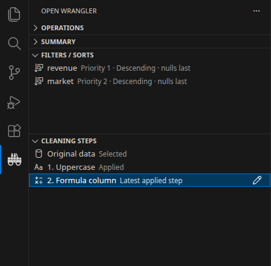</a></td>
    <td width="50%"><a href="images/readme/v1.2/gallery/latest-step-undone.png">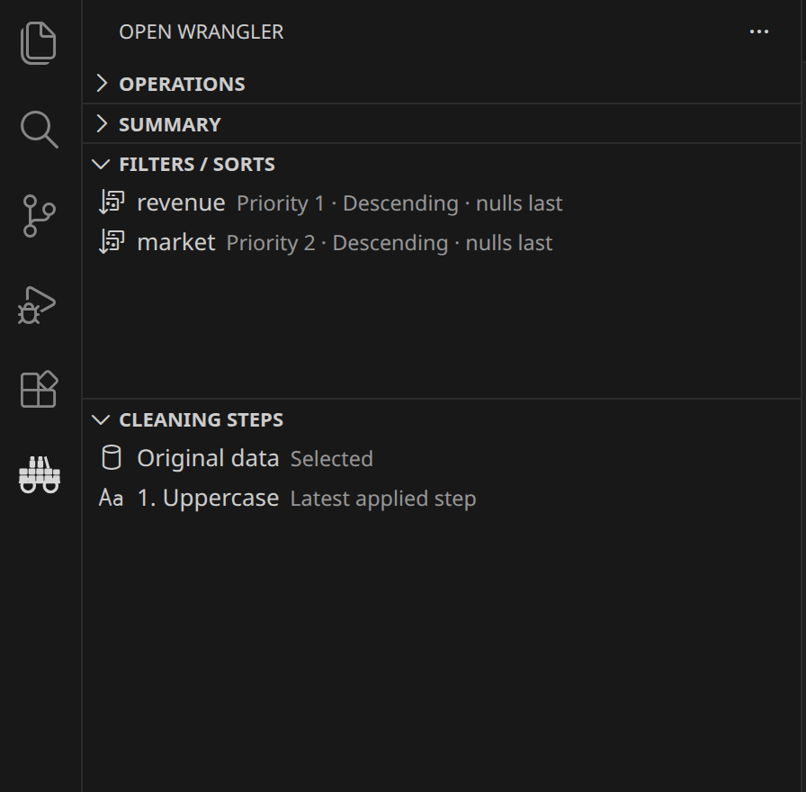</a></td>
  </tr>
  <tr>
    <td>Editing the latest step updates that history entry instead of adding a duplicate.</td>
    <td>Undo removes the latest step without clearing the rest of the plan, filters, or sorts.</td>
  </tr>
</table>

<a href="images/readme/v1.2/gallery/applied-step-inspection.png">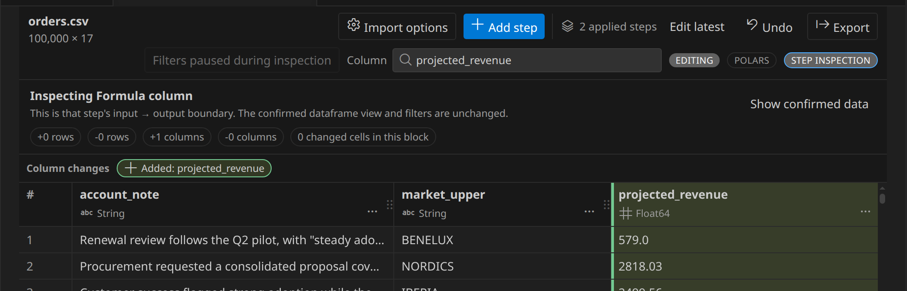</a>

Select any applied step to inspect that point in history, then return to confirmed data without changing the plan.

<table>
  <tr>
    <td width="50%"><a href="images/readme/v1.2/gallery/by-example-setup.png">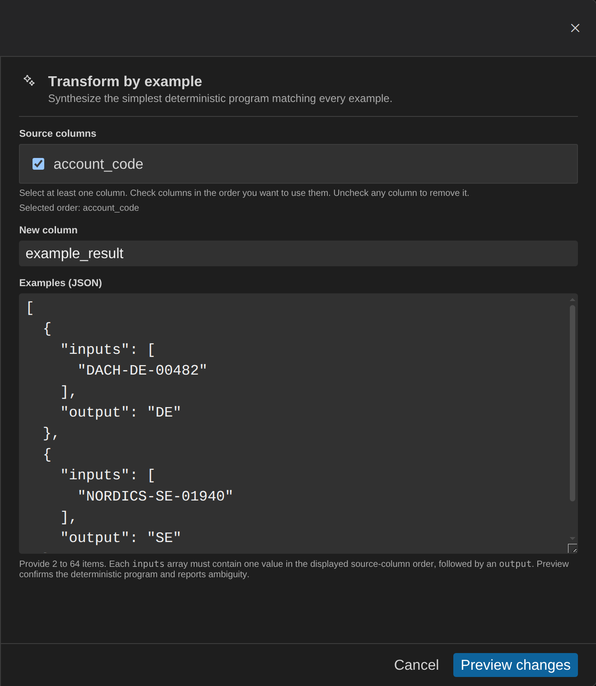</a></td>
    <td width="50%"><a href="images/readme/v1.2/gallery/by-example-preview.png">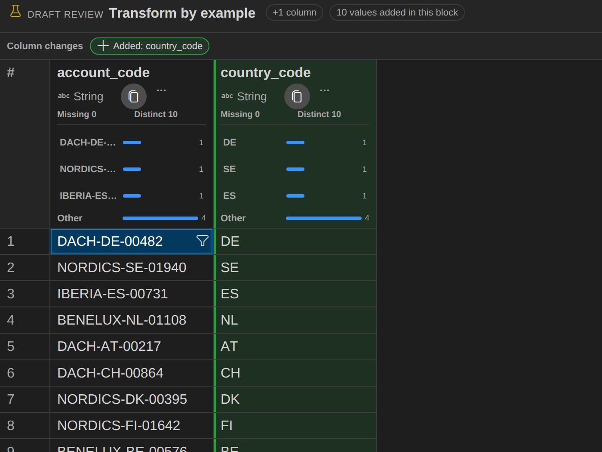</a></td>
  </tr>
  <tr>
    <td>Enter exact input and output examples for the account-code transformation.</td>
    <td>Preview the inferred transformation on unseen rows before applying it.</td>
  </tr>
</table>

## Export code and cleaned data

<table>
  <tr>
    <td width="50%"><a href="images/readme/v1.2/gallery/export-script.png">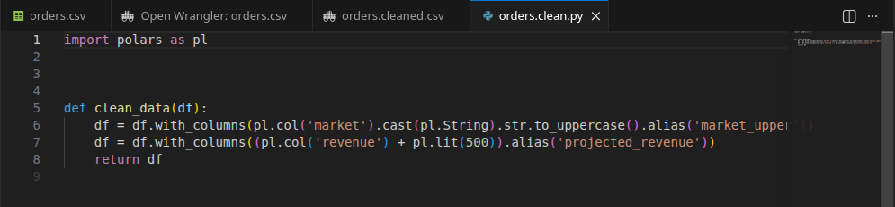</a></td>
    <td width="50%"><a href="images/readme/v1.2/gallery/export-data.png">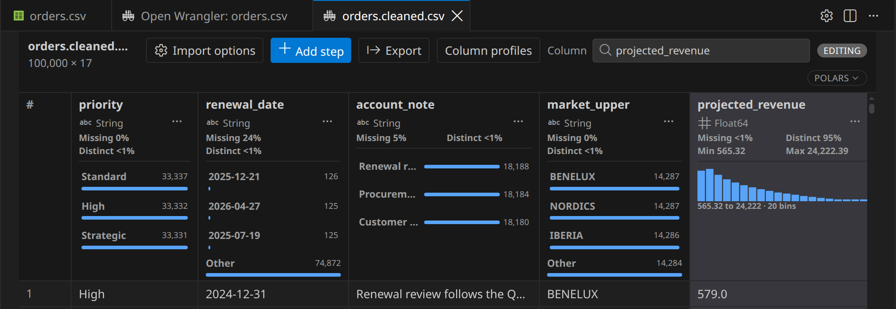</a></td>
  </tr>
  <tr>
    <td>Copy generated code or save it as a Python or R script. Python sessions can also insert it into the notebook.</td>
    <td>Editing sessions backed by Pandas, Polars, or DuckDB can export a cleaned CSV or Parquet file without overwriting the source.</td>
  </tr>
</table>

## Notebook dataframes

<table>
  <tr>
    <td width="51%"><a href="images/readme/v1.2/gallery/notebook-variable-picker.png">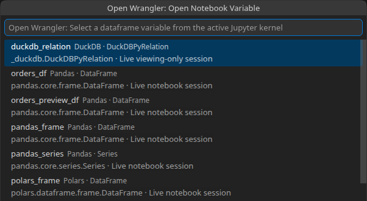</a></td>
    <td width="49%"><a href="images/readme/v1.2/gallery/notebook-code-insertion.png">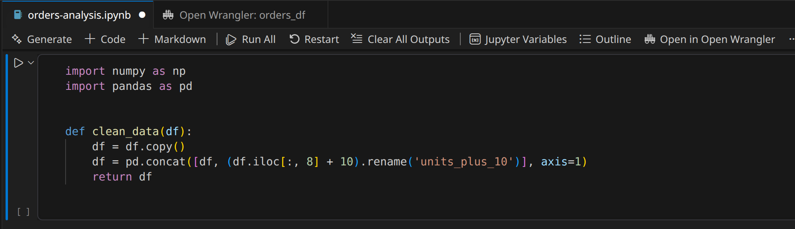</a></td>
  </tr>
  <tr>
    <td>The notebook picker labels each live variable by engine and dataframe type.</td>
    <td>Insert generated code into the notebook that opened the dataframe.</td>
  </tr>
</table>

<table>
  <tr>
    <td width="50%"><a href="images/readme/v1.2/notebook-pandas.png">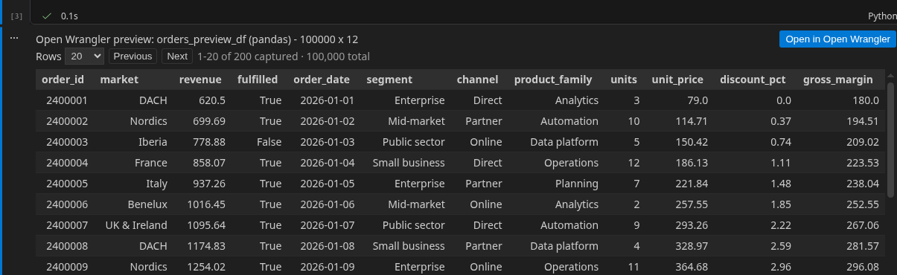</a></td>
    <td width="50%"><a href="images/readme/v1.2/gallery/notebook-polars.png">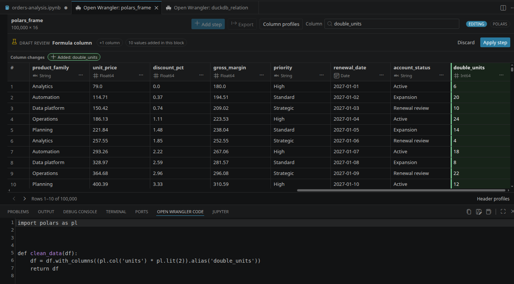</a></td>
  </tr>
  <tr>
    <td>Pandas outputs open as live Pandas dataframes.</td>
    <td>Polars dataframes stay native and generate Polars code.</td>
  </tr>
  <tr>
    <td width="50%"><a href="images/readme/v1.2/gallery/notebook-duckdb.png">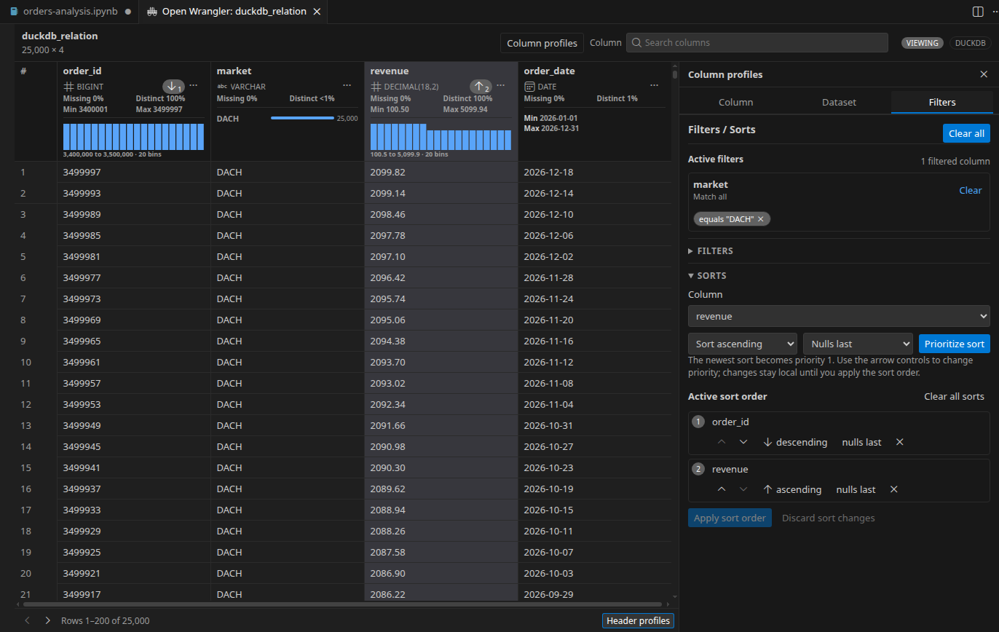</a></td>
    <td width="50%"><a href="images/readme/v1.2/gallery/notebook-pyspark.png">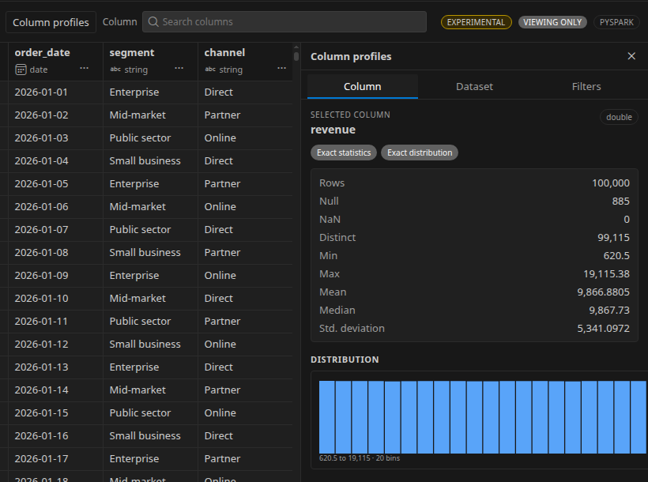</a></td>
  </tr>
  <tr>
    <td>Experimental DuckDB relations are view-only and do not require dataframe conversion.</td>
    <td>Local PySpark 4.2.x Classic and Connect batch DataFrames support viewing, filtering, sorting, paging, and profiles.</td>
  </tr>
</table>

PySpark support is notebook-only and view-only. It uses an existing local 4.2 Classic or Connect session. The first
page loads without counting or caching the entire DataFrame, and the exact row total appears after the last page. The
ordering badge distinguishes Spark source order from an explicit sort and explains why repeatable rows need a unique
final sort key.

## R notebooks (Open Wrangler 2)

<a href="images/editor-acceptance/vscode-notebook-r-picker-dark.png">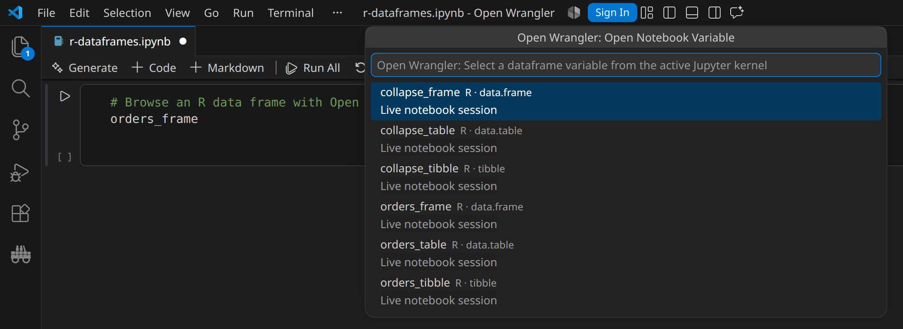</a>

Open Wrangler 2 development builds discover base `data.frame`, tibble, and `data.table` variables in the active
IRkernel. Each variable stays in R.

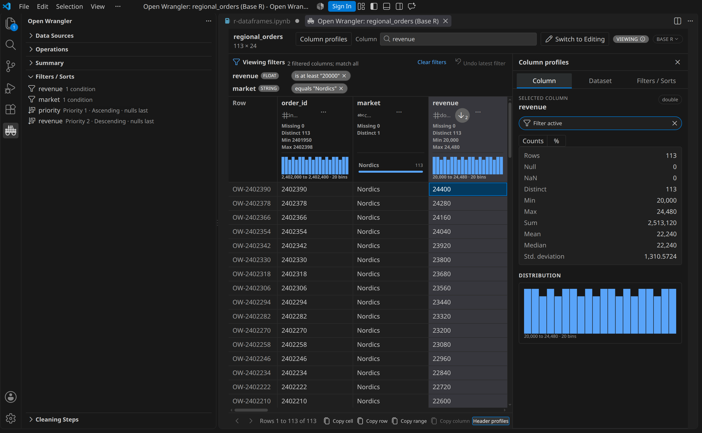

The current R workbench supports paging, filters, multi-column sorts, value search, and column and dataset profiles.
Editing mode currently supports Rename Column, Drop Columns, Select Columns, Clone Column, Text Length, and Lowercase.
Select keeps the order in which the columns were chosen. Text Length counts Unicode characters. Lowercase can update a
character or factor column or create a new character column. Both keep `NA`. All six use draft preview, generated R,
apply, discard, inspection, latest-step editing, and undo. Generated R can be copied or saved as a `.R` script.

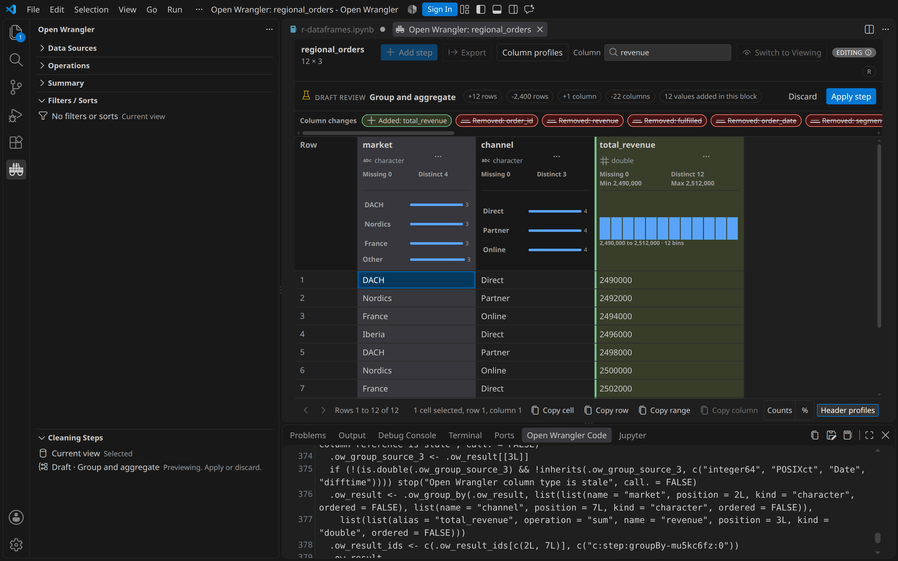

The image shows Rename Column in VS Code. Drop Columns, ordered Select Columns, Clone Column, Text Length, and Lowercase
use the same editing controls in VS Code and Cursor. These six operations work with base data frames, tibbles, and keyed data
tables; the other R cleaning operations are not available yet.

Other R cleaning operations, cleaned-data export, notebook insertion, Quarto, R Markdown, and plain `.R` files are
not supported yet. They are planned after the native notebook path is complete.

## DuckDB nested and temporal values

<a href="images/readme/v1.2/gallery/duckdb-rich-parquet.png">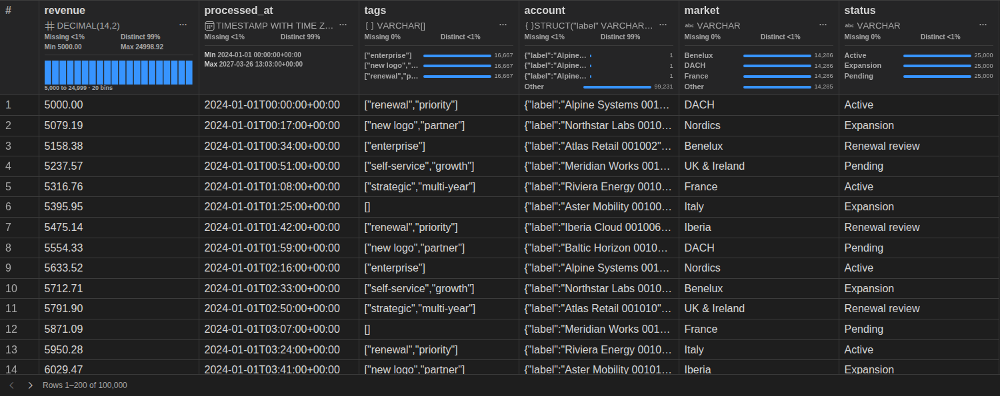</a>

Decimal, time-zone-aware timestamp, list, and struct values remain typed through the grid and summaries.

## Editor and theme support

<table>
  <tr>
    <td width="50%"><a href="images/readme/v1.2/gallery/cursor-explore.png">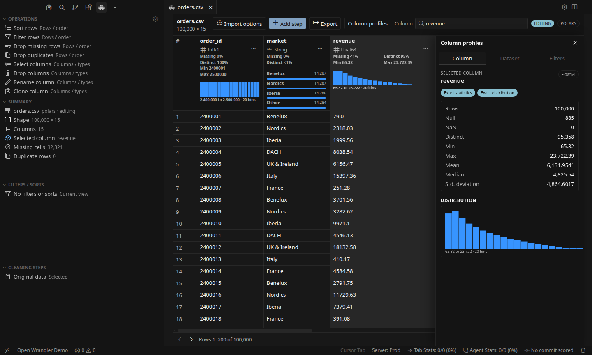</a></td>
    <td width="50%"><a href="images/readme/v1.2/gallery/high-contrast-explore.png">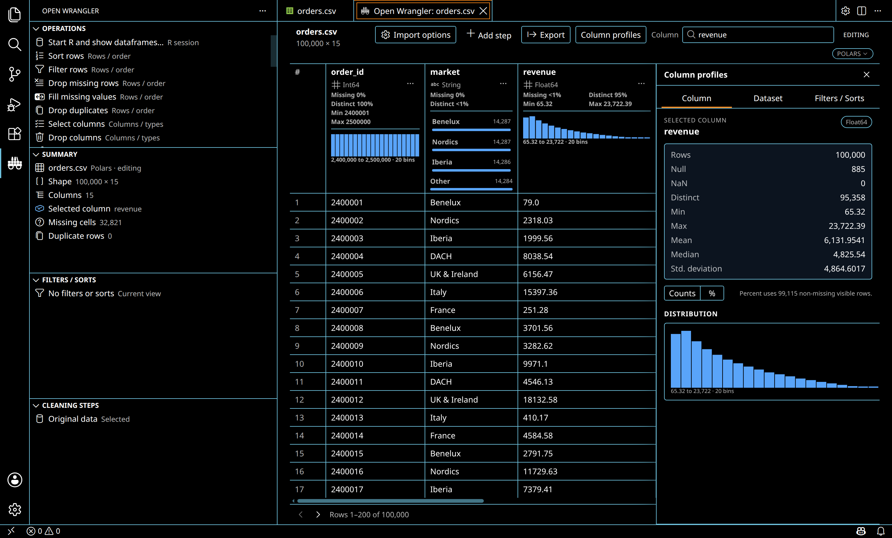</a></td>
  </tr>
  <tr>
    <td>The same VSIX is release-tested in VS Code and Cursor.</td>
    <td>The grid, sidebars, profiles, and controls use the editor's high-contrast theme tokens.</td>
  </tr>
</table>

Other desktop VS Code forks are experimental. The automated visual and accessibility suite also covers light and
dark themes, 80% to 200% zoom, keyboard-only operation, loading and error states, empty frames, long Unicode
content, and narrow and wide layouts. See [Testing](testing.md) for the acceptance process.
