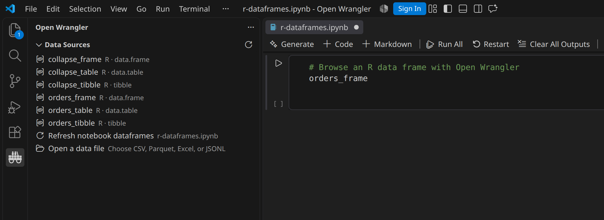
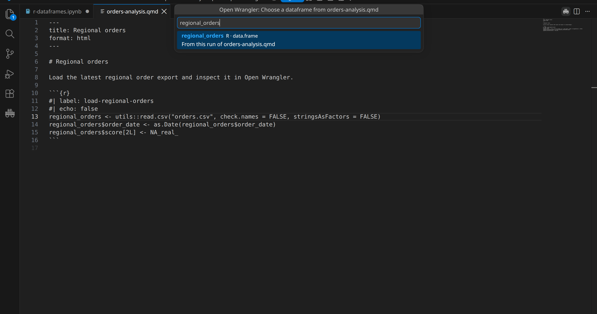
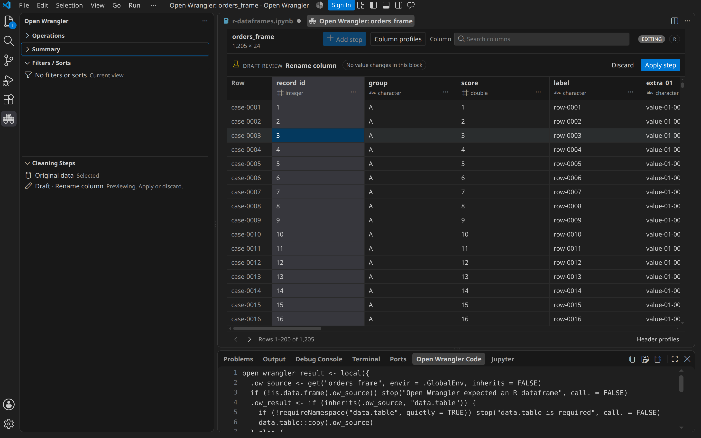
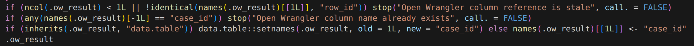

# Product gallery

These scenes use generated business data and show Open Wrangler as users see it in VS Code and Cursor. Dataset
sizes in the images describe the example, not a row or column limit.

[Workbench](#grid-and-sidebar) · [Files](#file-entry-points) ·
[Explore](#filters-profiles-sorts-and-column-search) · [Clean](#cleaning-drafts-and-history) ·
[Export](#export-code-and-cleaned-data) · [Notebooks](#notebook-dataframes) ·
[R preview](#r-notebooks-and-documents-199-preview) ·
[Editors](#editor-and-theme-support)

## Grid and sidebar

The workbench places the grid, column summaries, detailed profiles, and editor controls together.

Operations, dataset health, viewing state, and cleaning history appear beside the grid. Filters and sorts remain
separate from applied cleaning steps.

## File entry points

<table>
  <tr>
    <td width="62%"></td>
    <td width="38%"></td>
  </tr>
  <tr>
    <td>Use the Explorer context menu to open CSV, TSV, Parquet, JSONL, NDJSON, or Excel files.</td>
    <td>Use the editor-tab menu when the file is already open.</td>
  </tr>
</table>

The editor-title action is the shortest route when the source is already open. CSV and TSV inputs infer delimiter,
encoding, quote style, and header automatically. **Import options** is an explicit override for unusual sources.

## Filters, profiles, sorts, and column search

Click a column header to select it, or click a category or histogram bin in the header or Column profiles to filter.
The grid, profiles, and Filters / Sorts view stay synchronized. Above the grid, each active rule can be removed, the
latest filter can be undone, or all filters can be cleared without changing the source.

<table>
  <tr>
    <td width="50%"></td>
    <td width="50%"></td>
  </tr>
  <tr>
    <td>Counts / % is shared by header summaries and Column profiles. Focus a histogram bin to see its range, row count, and percentage.</td>
    <td>Reorder sort keys, change their direction and null placement, or remove them.</td>
  </tr>
</table>

When a categorical profile has more entries than fit in its summary, **More values…** opens the searchable value
list without running the profile again.

Column search reaches the complete schema and keeps type icons, full names, and keyboard navigation available even
for very wide dataframes.

## Cleaning drafts and history

<table>
  <tr>
    <td width="50%"></td>
    <td width="50%"></td>
  </tr>
  <tr>
    <td>Search or browse 28 operations, including custom code and transformations inferred from examples.</td>
    <td>Choose methods that fit the column type, including statistics by group, interpolation, ordered fills, and same-row fallbacks.</td>
  </tr>
</table>

Every operation follows draft → preview → apply or discard. The visible result and executable engine-native code
are available before a step joins the plan.

<table>
  <tr>
    <td width="50%"></td>
    <td width="50%"></td>
  </tr>
  <tr>
    <td>Editing the latest step updates that history entry instead of adding a duplicate.</td>
    <td>Undo removes the latest step without clearing the rest of the plan, filters, or sorts.</td>
  </tr>
</table>

Select any applied step to inspect that point in history, then return to confirmed data without changing the plan.

<table>
  <tr>
    <td width="50%"></td>
    <td width="50%"></td>
  </tr>
  <tr>
    <td>Enter exact input and output examples for the account-code transformation.</td>
    <td>Preview the inferred transformation on unseen rows before applying it.</td>
  </tr>
</table>

## Export code and cleaned data

<table>
  <tr>
    <td width="50%"></td>
    <td width="50%"></td>
  </tr>
  <tr>
    <td>Copy generated code or save it as a Python or R script. Notebook sessions and Open Wrangler-managed R documents can also insert it into the source that opened the dataframe.</td>
    <td>Pandas, Polars, DuckDB, and local R editing sessions can export cleaned data without overwriting the source. R uses nanoparquet for Parquet files.</td>
  </tr>
</table>

## Notebook dataframes

<table>
  <tr>
    <td width="51%"></td>
    <td width="49%"></td>
  </tr>
  <tr>
    <td>The notebook picker labels each live variable by engine and dataframe type.</td>
    <td>Insert generated code into the notebook that opened the dataframe.</td>
  </tr>
</table>

<table>
  <tr>
    <td width="50%"></td>
    <td width="50%"></td>
  </tr>
  <tr>
    <td>Pandas outputs open as live Pandas dataframes.</td>
    <td>Polars dataframes stay native and generate Polars code.</td>
  </tr>
  <tr>
    <td width="50%"></td>
    <td width="50%"></td>
  </tr>
  <tr>
    <td>Experimental DuckDB relations are view-only and do not require dataframe conversion.</td>
    <td>Local PySpark 4.2.x Classic and Connect batch DataFrames support viewing, filtering, sorting, paging, and profiles.</td>
  </tr>
</table>

PySpark support is notebook-only and view-only. It uses an existing local 4.2 Classic or Connect session. The first
page loads without counting or caching the entire DataFrame, and the exact row total appears after the last page. The
ordering badge distinguishes Spark source order from an explicit sort and explains why repeatable rows need a unique
final sort key.

## R notebooks and documents (1.99 preview)

Operations lists base `data.frame`, tibble, and `data.table` objects from the active IRkernel, including supported
collapse frames. Open Wrangler opens them without converting them to Python.

For `.Rmd` and `.qmd` files, put the cursor in an enabled R or Python chunk and choose **Open in Open Wrangler**.
Open Wrangler runs only that chunk in its existing R or Python session, then lists the dataframes from that session.
This scene pairs the official Quarto preview with the dataframe picker; rendering remains separate from execution.

**Run R Document in Open Wrangler…** is the explicit all-R fallback for trusted `.R`, `.Rmd`, and `.qmd` files. It
runs a plain R file or the document's top-level R chunks in a separate Open Wrangler process and includes unsaved
changes. It does not replace the cursor-owned path for mixed R and Python documents.

The workbench pages through the R object and supports filters, ordered sorts, value search, and column and dataset
profiles. Viewing changes do not alter the source object.

Editing follows the same draft, preview, code, and apply workflow as the Python engines. This example groups regional
orders and shows the changed data, cleaning history, and generated R before applying the step.

Generated R can be copied, saved as a script, or inserted into the notebook or R document that opened the dataframe.
See the [operation and command reference](reference.md) for the current R operation and export support.

Frames created with `collapse::qDF()`, `qTBL()`, and `qDT()` use the matching base-frame, tibble, and data-table paths.
Grouped `GRP_df` and indexed `indexed_frame` objects are not supported. R notebooks work on Windows; direct document
runs currently require macOS or Linux.

## DuckDB nested and temporal values

Decimal, time-zone-aware timestamp, list, and struct values remain typed through the grid and summaries.

## Editor and theme support

<table>
  <tr>
    <td width="50%"></td>
    <td width="50%"></td>
  </tr>
  <tr>
    <td>The same VSIX is release-tested in VS Code and Cursor.</td>
    <td>The grid, sidebars, profiles, and controls use the editor's high-contrast theme tokens.</td>
  </tr>
</table>

Other desktop VS Code forks are experimental. The automated visual and accessibility suite also covers light and
dark themes, 80% to 200% zoom, keyboard-only operation, loading and error states, empty frames, long Unicode
content, and narrow and wide layouts. See [Testing](testing.md) for the acceptance process.
