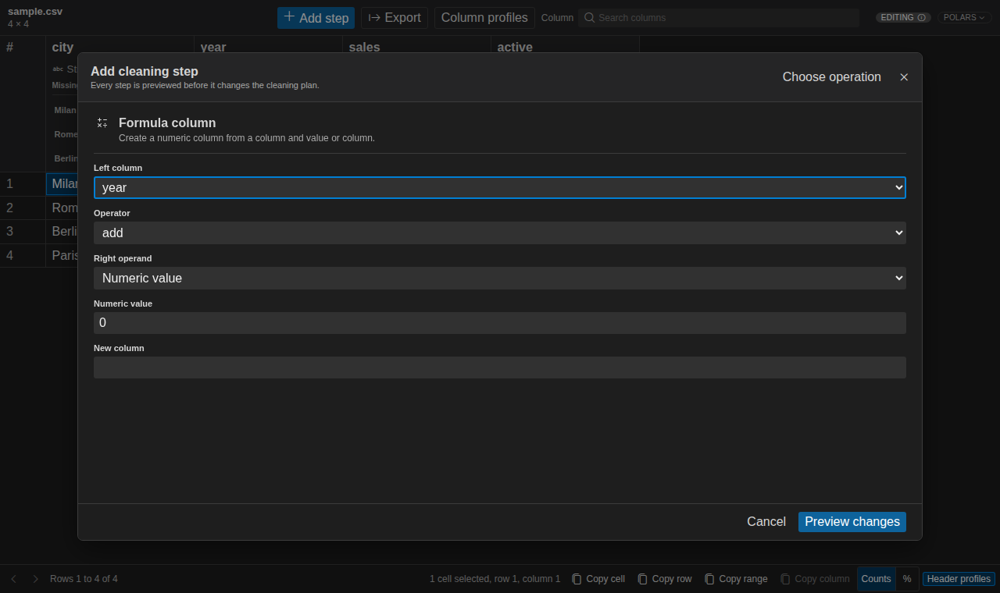
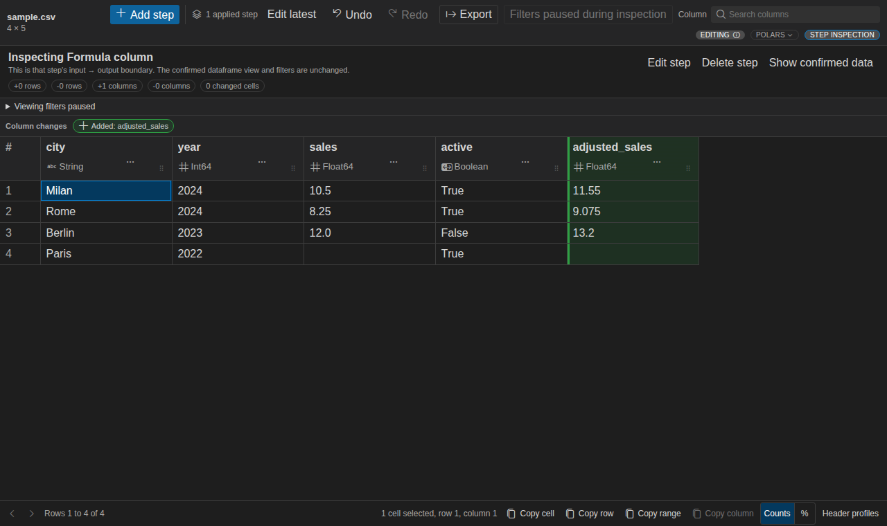
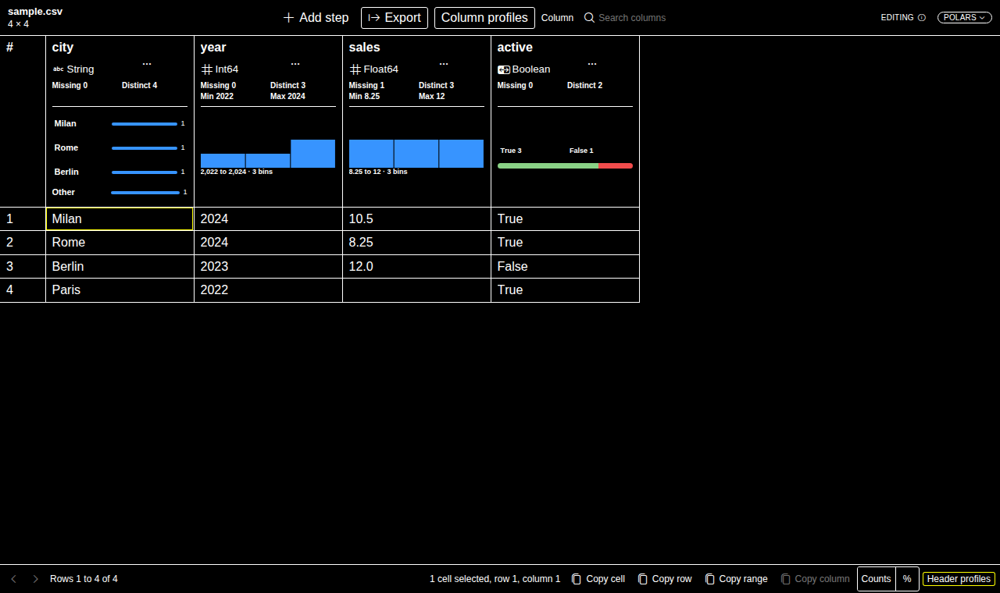

# Product gallery

These scenes use deterministic, license-clean fixtures. Full-editor images come from the real packaged VSIX in
an isolated VS Code profile; focused UI images load the same production webview bundle. Fixture dimensions show
the captured scenario, not product row or column limits.

## Explore in VS Code

The native sidebar keeps the operation catalog, active dataframe summary, viewing state, and cleaning history
visible beside the grid. Header summaries and the **Column profiles** drawer show exact statistics and a complete
distribution for the selected numeric column.

## Native Activity Bar views

<table>
  <tr>
    <td width="50%"></td>
    <td width="50%"></td>
  </tr>
  <tr>
    <td><strong>Operations and Summary remain useful without opening another editor tab.</strong> The catalog is grouped by task, while source, engine, mode, shape, selection, missing cells, and duplicate rows stay visible beside the dataframe.</td>
    <td><strong>Viewing state and cleaning history remain independent.</strong> Two sorts retain ordered priorities and never masquerade as cleaning steps; Original data, applied history, and the current draft stay separately inspectable.</td>
  </tr>
</table>

## Review a cleaning workflow

The newest viewing sort is priority 1, priorities remain reorderable, and neither sort becomes a cleaning step.
The separate draft adds a column, highlights changed values, exposes Apply and Discard, and generates executable
Polars code in the native bottom panel.

## Open files where you already work

### Editor title action

Open a supported file without leaving its current editor.

### Tab context menu

The same command is available from the open editor tab.

CSV and TSV inputs infer delimiter, encoding, quote style, and header automatically. **Import options** remains
available for explicit overrides.

## Notebook workflows

### Pandas inline preview

The portable inline table is stored with the notebook. **Open in Open Wrangler** reconnects to the complete,
current live variable and pages it in the workbench.

### Polars live editing

The dataframe remains in Polars while Open Wrangler pages, profiles, previews the draft, computes the diff, and
generates native code. The README uses a pixel-exact crop of this complete scene at full content width so the
draft values, engine badge, and generated code remain readable.

### DuckDB live relation

The viewing-only session queries the exact originating `DuckDBPyRelation`; it does not convert through Pandas,
Polars, or Arrow. The image shows a real filter, two reorderable sort priorities, requested profiles, and bounded
paging. The README uses a pixel-exact crop of this complete scene at full content width so the native grid,
engine badge, filter, and sort controls remain readable.

### PySpark Classic live notebook

PySpark 4.2 support is experimental and viewing-only. Filtering, sorting, paging, and requested profiling run in
Spark; only bounded results return to the notebook runtime. File opening, cleaning, export, code insertion, and
saved inline snapshots are not supported.

## Rich DuckDB file types

This focused production-webview scene uses a native DuckDB session over a deterministic 100,000-row Parquet
fixture. Decimal, time-zone-aware timestamp, list, and struct values remain typed through the grid and summaries.
The detail removes only the unused right canvas; open it for the complete 1920 × 640 source scene.

## Transform by example

<table>
  <tr>
    <td width="50%"></td>
    <td width="50%"></td>
  </tr>
  <tr>
    <td><strong>Teach it.</strong> Give exact source/output examples: <code>DACH-DE-00482 → DE</code> and <code>NORDICS-SE-01940 → SE</code>.</td>
    <td><strong>Review it.</strong> Confirm the synthesized split across unseen account IDs before applying the new column.</td>
  </tr>
</table>

## Focused interaction and accessibility states

<table>
  <tr>
    <td width="50%"></td>
    <td width="50%"></td>
  </tr>
  <tr>
    <td><strong>Operation picker.</strong> Search the complete transformation catalog by task.</td>
    <td><strong>History inspection.</strong> Select an applied step without mutating the current plan.</td>
  </tr>
</table>

**High contrast.** The production UI follows VS Code theme tokens and remains keyboard accessible.
