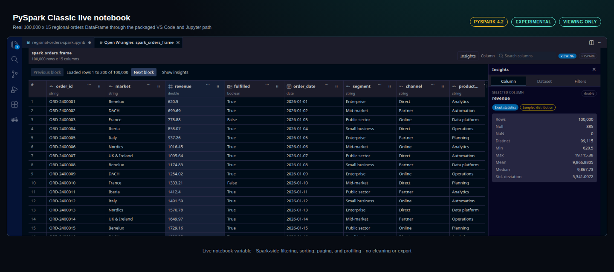

# Product gallery

The two primary README images stay compact. This gallery records additional engine surfaces from deterministic,
license-clean fixtures without implying support that the extension does not provide.

## DuckDB rich Parquet file

This scene uses the production webview bundle and a native DuckDB session over a real Parquet file. Decimal,
time-zone-aware timestamp, list, and struct values remain typed through the grid and summaries. DuckDB notebook
relations are not currently supported.

## PySpark Classic live notebook

This scene comes from the real packaged VS Code and Jupyter path over deterministic regional-orders data. It is
an experimental, viewing-only live notebook session. Filtering, sorting, bounded paging, and requested profiling
run in Spark. No PySpark file opening, cleaning, data export, code insertion, or saved inline snapshot is shown or
supported here.
