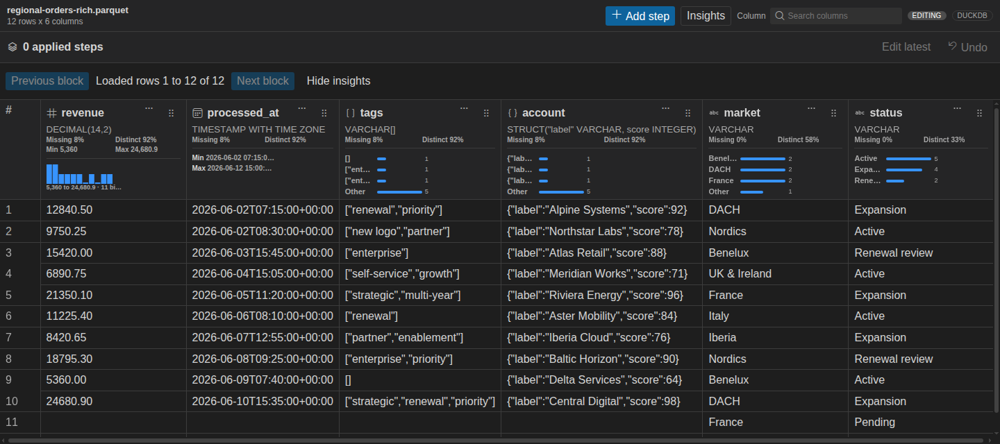

# Product gallery

The two primary README images stay compact. This gallery records additional engine surfaces from deterministic,
license-clean fixtures without implying support that the extension does not provide.

## DuckDB rich Parquet file

This scene uses the production webview bundle and a native DuckDB session over a real Parquet file. Decimal,
time-zone-aware timestamp, list, and struct values remain typed through the grid and summaries. DuckDB notebook
relations are not currently supported.
