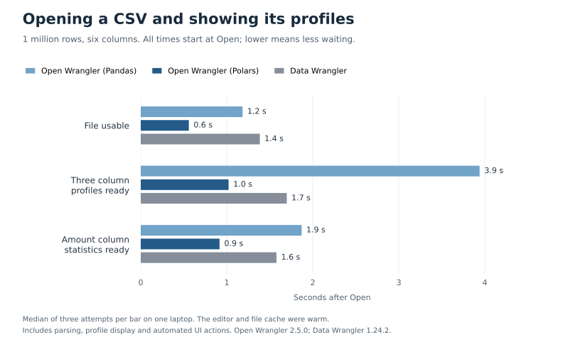

# Opening files, column profiles and cleaning

A local comparison of Open Wrangler 2.5.0 and Microsoft Data Wrangler 1.24.2 in VS Code.

- **Open Wrangler with Polars had the lowest median times for opening these CSV files and showing their profiles.**
  The million-row file was responsive in 0.6 seconds, versus 1.4 seconds in Data Wrangler.
- **Open Wrangler with Pandas was slower to show million-row header profiles.** Its three tested headers were ready
  in 3.9 seconds. Data Wrangler showed them in 1.7 seconds; Open Wrangler with Polars took 1.0 second.
- **Data Wrangler opened already-loaded notebook dataframes sooner**, by about 0.3 seconds. That task excludes reading a file.
- **Open Wrangler completed the tested cleaning action sooner on the 100,000-row notebook inputs.** Too few million-row
  attempts completed with valid timings to support a firm cleaning comparison.

These are small repeated tests on one laptop, not a general speed ranking. The data consists of two synthetic tables
with 100,000 and 1 million rows, saved as approximately 5.3 MB and 53.9 MB CSV files. Each has six columns: an ID,
numeric amount, category, Boolean, date and timestamp. Ten percent of amounts are missing. Wide tables, complex strings
and other data distributions may behave differently.

The three header profiles are `id`, `amount` and `category`. The tables below include both file sizes.

## Opening a CSV file

Each product opened the same CSV contents with its default import options. Open Wrangler was tested separately with
Pandas and Polars; Data Wrangler reported Pandas. The clock starts at the final **Open** action, so it includes parsing
and any runtime connection or startup the product performs. Opening ends when the correct rows appear and selecting
a new row responds.

| Rows      | Open Wrangler, Pandas | Open Wrangler, Polars |     Data Wrangler |
| --------- | --------------------: | --------------------: | ----------------: |
| 100,000   |                 0.7 s |                 0.6 s | 1.1 s, 2 complete |
| 1 million |                 1.2 s |                 0.6 s |             1.4 s |

Times are medians of three planned attempts. Data Wrangler's third 100,000-row attempt remained at **Connecting to
runtime** until the 60-second observation limit. VS Code reported that it was waiting for a Jupyter session to become
idle. We did not establish the cause. That failure remains recorded and was not replaced; the other 17 file attempts
completed. One Open Wrangler Polars 100,000-row response took 1.3 seconds, so its median also hides variation.

The editor and file cache were warm. Before each attempt, the CSV bytes were read and checked, and a fresh filename
avoided saved viewer state. This does not measure cold-disk performance or prove that every internal computation was new.
[File measurements](file-samples.json) include the earlier grid-display times, individual results and ranges.

## Seeing column profiles after opening the file

These times use **the same Open action as the file-opening table**, not a new clock after the file has loaded.
The test selected `amount` by its column-name label and opened the native profile panel if necessary.

“Three column profiles” means the visible header summaries for `id`, `amount` and `category`: missing and distinct
counts, numeric ranges and histograms, or category frequencies. “Amount column statistics” means its completed numeric statistics.
The remaining three headers were outside this comparison; all six columns were loaded.

| Visible result, rows                | Open Wrangler, Pandas | Open Wrangler, Polars |     Data Wrangler |
| ----------------------------------- | --------------------: | --------------------: | ----------------: |
| Three column profiles, 100,000      |                 0.9 s |                 0.6 s | 1.1 s, 2 complete |
| Amount column statistics, 100,000   |                 0.8 s |                 0.7 s | 1.3 s, 2 complete |
| Three column profiles, 1 million    |                 3.9 s |                 1.0 s |             1.7 s |
| Amount column statistics, 1 million |                 1.9 s |                 0.9 s |             1.6 s |

The mean and row count were observed in the same check as the complete amount summary in every completed attempt.
Open Wrangler with Pandas showed that summary before all three tested headers were ready. A fast selected-column
summary and fast header profiles are therefore separate results.

These are observed display times, including selection, panel actions and the automated test's clicks and checks. Checks occur between
actions, so a delayed click can also delay noticing a completed profile. They do not isolate fresh profile computation.
Returning to `amount` after selecting `id` took less than 0.1 seconds in all 17 completed attempts; that measures a
previously viewed summary. Data Wrangler also shows quartiles, skew and kurtosis. Matching values does not mean the
products performed equal work.

## Opening data already loaded in a notebook

Python and the notebook were already running, and the dataframe was already loaded. A fresh viewer was opened each
time and timed until selecting a row responded. These measurements exclude CSV parsing.

| Dataframe |      Rows |         Open Wrangler | Data Wrangler |
| --------- | --------: | --------------------: | ------------: |
| Pandas    |   100,000 |                 0.7 s |         0.4 s |
| Pandas    | 1 million |                 0.8 s |         0.5 s |
| Polars    |   100,000 |                 0.7 s |         0.4 s |
| Polars    | 1 million | 0.8 s, 2 measurements |         0.5 s |

All other cells have three measurements. Open Wrangler used Polars directly. Data Wrangler accepted the Polars variable
and reported Pandas; its opening time includes any conversion it performed.

## Removing rows with a missing value

The notebook test selected `amount` and removed rows where it was empty, leaving 90,000 or 900,000 rows. Untimed exports
were checked against the expected rows, order and values.

Times include **both Preview and Apply**, from requesting a preview until the applied result responded to selection.
Choosing the operation and filling its form are excluded. Each total comes from one complete attempt, not a sum of
separate median times.

| Dataframe |      Rows |     Open Wrangler |     Data Wrangler |
| --------- | --------: | ----------------: | ----------------: |
| Pandas    |   100,000 | 0.6 s, 3 complete | 1.6 s, 2 complete |
| Polars    |   100,000 | 0.5 s, 3 complete | 1.2 s, 3 complete |
| Pandas    | 1 million | 1.6 s, 3 complete | 1.5 s, 1 complete |
| Polars    | 1 million | 0.6 s, 1 complete | 1.5 s, 2 complete |

There were three planned attempts per cell. Four Data Wrangler attempts did not reach the expected ready state before
the 60-second workflow limit; the cause was not established. Two Open Wrangler Polars attempts lost a valid timing
because the test followed the wrong grid row after scrolling. Those are measurement errors, not slow product runs.
No missing result was replaced with a successful retry.

Method, profile limitations and data checks

Measurements were collected on September 16, 2026: VS Code 1.137.0, Ubuntu 26.04, Intel Core Ultra 9 185H,
Python 3.12.14, Pandas 3.0.5, Polars 1.44.1 and PyArrow 25.0.1. VS Code used isolated storage and a private
1280 by 900 software-rendered display. Installation, interpreter selection and Workspace Trust setup were untimed.
Only public product controls and rendered UI were used. Microsoft extension package contents were not inspected.

The CSV files contain IDs from zero to N minus one. Amount is the ID modulo 1,000, blank when the ID is divisible by ten;
category cycles through Alpha, Beta and Gamma, blank when the ID is divisible by seventeen; the Boolean alternates,
blank when the ID is divisible by nineteen. Dates cycle through 366 days from January 1, 2024; timestamps cycle through 86,400 seconds from midnight
on that date. Every serialized cell and its order were checked independently before use. The numeric amount has
900 distinct present values, mean 500 and sum 450 times N. Source hashes remained unchanged after collection.

Default CSV imports retain date and timestamp fields as strings in these routes. Pandas numeric missing values are
NaN; Polars uses null. The notebook inputs instead use native dates/datetimes. Their exact schemas and preparation
are in the [original notebook and other-engine records](samples.json); file inputs and hashes are in
[file measurements](file-samples.json).

Each file size had three fixed repetitions, ordered Pandas/DW/Polars, DW/Polars/Pandas, then Polars/Pandas/DW.
The 100,000-row files preceded the million-row files. Explorer, Chat and the bottom panel were closed before Open;
native product panels could open during the measured interaction. Closing an automatically opened bottom panel was
included in the clock. The three named headers fit beside either product's native profile panel. There were no active
view filters and the full row count was checked after selection. A failed viewer was closed normally before continuing.

A temporary controller checked the UI at 100 ms intervals between actions. That interval is not an accuracy bound:
actionability waits, scheduling and rendering also affect observations. A single 60-second budget covered each attempt.
All failures and setup corrections were retained. No benchmark job or recurring comparison was added to CI.

The earlier notebook profile measurements clicked the whole `amount` header after opening, and sometimes also opened
Open Wrangler's profile panel. Statistics could already have been computed. During later file-test setup, a whole-header
click was found to hit an Open Wrangler histogram bin and add a view filter; the file collector uses the exact label.
Historical screenshots show the intended final states without active filters, but they do not reconstruct the earlier
click target or rule out a transient side action. Those old profile intervals remain in the raw records as
interaction-to-display observations and are not used here to rank profiling speed.

Released Open Wrangler's [Pandas](https://github.com/Matt17BR/openwrangler/blob/6e1c40799e0ae2d88cb30efd8348af1f01e635aa/python/openwrangler_runtime/engines/pandas_engine.py#L1140)
and [Polars](https://github.com/Matt17BR/openwrangler/blob/6e1c40799e0ae2d88cb30efd8348af1f01e635aa/python/openwrangler_runtime/engines/polars_engine.py#L713)
summaries use the full selected column, with bounded returned values and histogram bins. Data Wrangler's scan scope
is undisclosed. Three observations cannot establish tail latency, scaling or performance across other datasets.

Untimed cleaned exports were checked once per product, notebook input and size. Open Wrangler Polars preserved every
dtype. Data Wrangler's Polars-input Parquet export changed Date to midnight Datetime(ms); other recorded dtypes matched.
Data Wrangler's Pandas export omitted the index. Open Wrangler offers preserve/omit, and preservation was selected
and verified. These observations do not locate internal conversions or establish in-memory index loss.

Other Open Wrangler engines

These earlier observations use different entry points. They do not compare engines or measure total setup time.
Times are median seconds from three observations.

| Engine        |      Rows | Open, responsive | Selected profile display |
| ------------- | --------: | ---------------: | -----------------------: |
| DuckDB 1.5.5  |   100,000 |            1.5 s |                    0.2 s |
| DuckDB 1.5.5  | 1 million |            1.9 s |                    0.6 s |
| R 4.5.2       |   100,000 |            0.7 s |                    0.7 s |
| R 4.5.2       | 1 million |            0.7 s |                    0.8 s |
| PySpark 4.2.0 |   100,000 |            0.8 s |                    0.7 s |
| PySpark 4.2.0 | 1 million |            0.8 s |                    1.5 s |

DuckDB used an ordered CSV relation without materialization, opened through its direct Variables action. Spark used
an uncached local generated dataframe, two partitions and a 1 GiB driver, opened through the viewer chooser.
Its grid has an unknown total; the selected profile reports the full row count.

R used **Run R Document in Open Wrangler**, a Preview route. Each invocation starts a new process and evaluates
the input before the timed dataframe-picker action. At 1 million rows, the distribution is sampled and distinct count
and median are unavailable. The million-row R and Spark measurements followed an editor restart.

[Raw records and ranges](samples.json) retain these measurements, the notebook failures and superseded controller
attempts. [Earlier runtime tasks](../2026-09-14-everyday-tasks/review.md) have different timing boundaries and remain
historical context.

